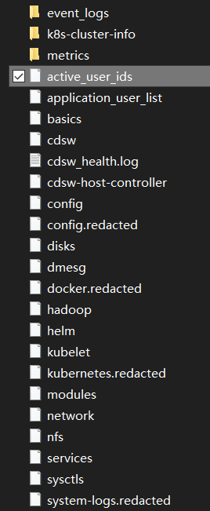

## cdsw logs output

If we run `cdsw logs` on the CDSW Master node, we'll see output as below:

```plaintext
Generating Cloudera Data Science Workbench diagnostic bundle...
Collecting basic system info...
Collecting kernel parameters...
Collecting kernel messages...
Collecting the list of kernel modules...
Collecting the list of systemd units...
Collecting cdsw details...
Collecting application configuration...
Collecting disks information...
Collecting Hadoop configuration...
Collecting network information...
Collecting system service statuses...
Collecting nfs information...
Collecting Docker info...
Collecting Kubernetes info...
Collecting Helm info...
Collecting custom patches...
cp: cannot stat ‘/etc/cdsw/patches’: No such file or directory
Collecting Kubelet logs...
Collecting CDSW Host Controller logs...
Collecting system logs...
Collecting Kubernetes cluster info dump...
Exporting user ids...
Collecting health logs...
Collecting event logs...
tar: Removing leading `/' from member names
Event logs collected.
Exporting metrics...
Redacting logs...

Producing redacted logs tarball...
Logs saved to: cdsw-logs-host-10-17-102-138-2021-05-26--11-28-01.redacted.tar.gz
Cleaning up...
```

## Important content for troubleshooting

Here is a list of contents in the CDSW diagnostic bundle:



Some of the contents are retrieved from CDSW's application, for example, `active_user_ids` and `application_user_list` is retrieved from internal used Postgres SQL database.

- `active_user_ids`


    `kubectl --namespace="${CDSW_NAMESPACE}" exec "$db_pod" -- psql -U "$db_user" -c "SELECT id, username_hash as uid from users where deactivated='false' and type='user';" >>"${LOG}"/active_user_ids`


- `application_user_list`


    `kubectl --namespace="${CDSW_NAMESPACE}" exec "$db_pod" -- psql -U "$db_user" -c "SELECT username_hash as uid from users where deactivated='false' and type='user';" >>"${LOG}"/application_user_list`


The above 2 code snippets comes from `cdsw-logs-utils.sh`, a script used by
CDSW.
So, we can tell, there's no difference between them.

### `cdsw`


There are other information from CDSW's internal services, such as the `cdsw`,
it contains the `cdsw status` command line output and some logs retrieved by
`jounalctl`, which confused me, because if you look into `service`, you can see
bunch of service units.
So, when it comes to `services`. Why I am confused, because if you use `systemctl list-units` on a node of CDSW, you will see many things that belong to the container, such as **virtual-block**, **virtual-net** and **container shim**. I don't know why these appear in the `systemctl list-units` of the host machine.

### `cdsw_health.log`


This is simply outputting the results of running `cdsw status` multiple times.
Each time `cdsw status` will call `kubectl` to list the pods of the `kube-system` and `default` namespaces. `kube-system` holds the core components of K8s such as `ApiServer`, `ControllerManager` and `Scheduler`, as well as necessary components such as `CNI` and `kube-proxy`.
And what runs in the `default` namespace is the components of the CDSW Application Role, which is the application stack that constitutes our CDSW. Including Web UI, DB, etc.

### `hadoop`


The content of this file is very useful. It collects information about the **Gateway Role** of the Hadoop cluster on the host.
For example, **Spark Gateway**, **Hive Gateway**, the content of `/etc/alternatives`, `hadoop classpath`, etc.
When comparing the differences in Hadoop configuration between CDSW nodes and nodes, we can consider comparing this file. Sometimes the stale node may not be seen on the CM UI, but the configuration is not updated.

### `k8s-cluster-info`


This folder contains the detailed info of every K8s namespace, including the
workload controller(deployment, statefulset, daemonset), and logs of every pod.


### `metrics`


This folder contains the aggregated metrics of Sessions created in CDSW.
If we want to find out how many resources were used for a specific session/job,
the time of creation and how does the session ends(killed by user or timeout),
it's useful.


### `event_logs`


This folder contains the event info, for example, when you create a project,
a session, etc.

---


Other files are just as the name suggests. For example:


- `helm` contains the `helm` command output, to see the `helm` status of the applications deployed in the K8s cluster.


    <ins>P.S.: helm is a package management tool with version control functionality in Kubernetes.</ins>


- `kubernetes.redacted` contains the `kubectl get pods --all-namespaces` and `kubectl describe pod {podName}` of every pod, etc.
