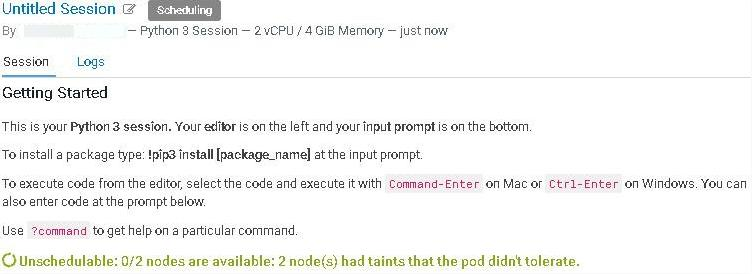
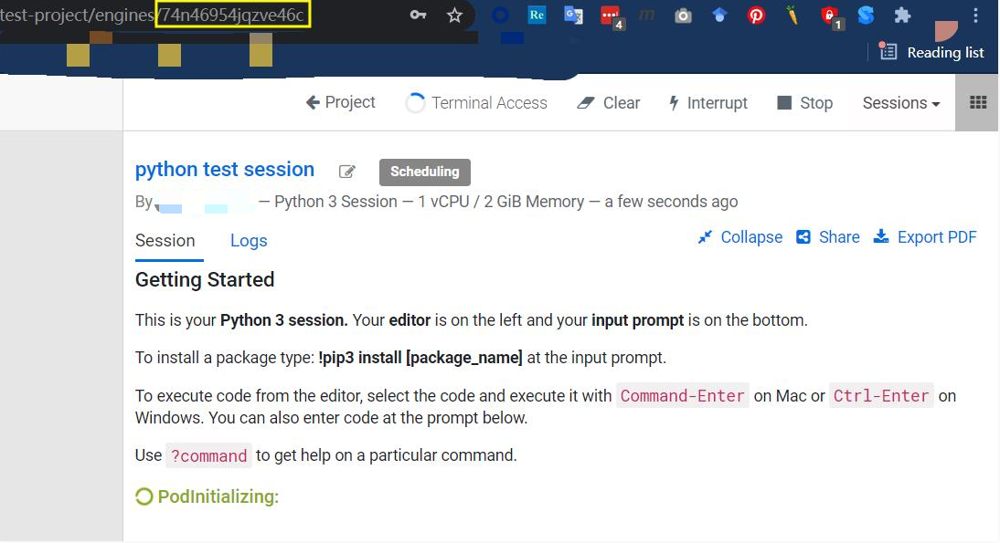
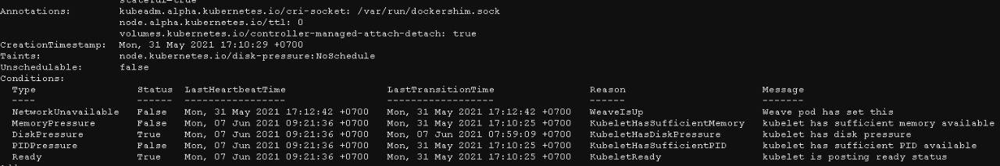

<!--StartFragment-->

* The purpose of this article
* Problem Statement
* Troubleshooting

  * Step-1: Use the `kubectl describe pod` command to view the details of the Pod of the Session.
  * Step-2: Use `kubectl describe node` to view the status of all the nodes.
  * Step-3: Verify the kubelet process argument.
  * Step-4: Check the `nodefs` and `imagefs` recognized by kubelet.
* Summary

<!--EndFragment-->

<!--StartFragment-->

## The purpose of this article

This article records a troubleshooting about CDSW unable to start Session. The reason for the problem involved is that the remaining capacity of nodefs and imagefs used by Kubelet has reached the threshold of evicting the node, resulting in the node being labeled as NoSchedule taint by Kubernetes.

<!--EndFragment-->

<!--StartFragment-->

## Problem Statement

One of my customer reported that they found their CDSW failed to start Sessions. The following is a screenshot of the failure to start Session on CDSW.



We can see that in the Session log, there are the following messages:

> Unschedulable: 0/2 nodes are available: 2 node(s) had taints that the pod didn't tolerate.

<!--EndFragment-->

<!--StartFragment-->

## Troubleshooting

### [](#step-1-use-the-kubectl-describe-pod-command-to-view-the-details-of-the-pod-of-the-session)Step-1: Use the `kubectl describe pod` command to view the details of the Pod of the Session.

Every Session created by CDSW is a Pod, and the name of the Pod is a random string. This Pod will be placed in a NameSpace named "default-user-{number}".

The following figure is an example of the random Pod name generated when the Session is created.



Now, we can use the following `kubectl` commands to navigate to the Pod and look into the detail of this Pod. First you have to use root user to log in to CDSW Master node.

```bash
kubectl get pods --all-namespaces | sed -rn '1p;/74n46954jqzve46c/Ip'
```

Sample output:

```plaintext
NAMESPACE        NAME                                          READY   STATUS      RESTARTS   AGE
default-user-1   74n46954jqzve46c                              3/3     Running     0          58m
```

```bash
kubectl --namespace=default-user-1 describe pod 74n46954jqzve46c
```

Sample output:

```plaintext
Name:         74n46954jqzve46c
Namespace:    default-user-1
Priority:     0
Node:         host-10-17-103-219/10.17.103.219
Start Time:   Wed, 16 Jun 2021 16:11:58 +0000
Labels:       ds-role=session
              ds-runtime=74n46954jqzve46c
              livelog-published-container=engine
Annotations:  cluster-autoscaler.kubernetes.io/safe-to-evict: false
              seccomp.security.alpha.kubernetes.io/allowedProfileNames: runtime/default
              seccomp.security.alpha.kubernetes.io/defaultProfileName: runtime/default
Status:       Failed
Reason:       Evicted
Message:      Pod The node was low on resource: [DiskPressure].
...
```

Please pay attention to the `status`, `reason` and `message` above.

<!--EndFragment--><!--StartFragment-->

### Step-2: Use `kubectl describe node` to view the status of all the nodes.

At this time, if we use kubectl desscribe node to view the details of all nodes, we will find a situation similar to the following screenshot:



### [](#step-3-verify-the-kubelet-process-argument)Step-3: Verify the kubelet process argument.

```bash
ps aux | sed -rn '1p;/kubelet/Ip' | grep -v sed
```

Sample output:

```plaintext
root     20348  8.2  0.5 2431868 95304 ?       Sl   01:27  47:58 /opt/cloudera/parcels/CDSW-1.9.1.p1.10118148/kubernetes/bin/kubelet --kubeconfig=/etc/kubernetes/kubelet.conf --config=/etc/cdsw/scratch/kubelet.k8s.conf --bootstrap-kubeconfig=/etc/kubernetes/bootstrap-kubelet.conf --feature-gates=SupportPodPidsLimit=false --authorization-mode=Webhook --client-ca-file=/etc/kubernetes/pki/ca.crt --read-only-port=0 --fail-swap-on=false --network-plugin=cni --cni-conf-dir=/opt/cloudera/parcels/CDSW-1.9.1.p1.10118148/cni/net.d --cni-bin-dir=/opt/cloudera/parcels/CDSW-1.9.1.p1.10118148/cni/bin --cluster-dns=100.77.0.10 --cluster-domain=cluster.local --runtime-cgroups=/systemd/system.slice --kubelet-cgroups=/systemd/system.slice --kube-reserved=cpu=1,memory=2Gi --system-reserved=cpu=500m,memory=1Gi --eviction-hard=memory.available<500Mi --eviction-soft=imagefs.available<20% --eviction-soft-grace-period=imagefs.available=24h --v=2 --tls-cipher-suites=TLS_ECDHE_RSA_WITH_AES_256_GCM_SHA384,TLS_ECDHE_RSA_WITH_AES_128_GCM_SHA256
```

Notice these arguments:

* \--eviction-hard=memory.available<500Mi
* \--eviction-soft=imagefs.available<20%
* \--eviction-soft-grace-period=imagefs.available=24h

Obviously, the reason why we are now seeing Pod being evicted is because all Nodes are marked with taints. Regarding this taint, the prompt we got was "Disk Pressure". This must be due to `imagefs.available<20%` then.

So what is `imagefs.available`?

We can find relevant explanations on the [Kubernetes official website](https://kubernetes.io/docs/concepts/scheduling-eviction/node-pressure-eviction/#node-conditions).

| Node Condition | Eviction Signal                                                               | Description                                                                                                                  |
| -------------- | ----------------------------------------------------------------------------- | ---------------------------------------------------------------------------------------------------------------------------- |
| DiskPressure   | nodefs.available, nodefs.inodesFree, imagefs.available, or imagefs.inodesFree | Available disk space and inodes on either the node's root filesystem or image filesystem has satisfied an eviction threshold |

### [](#step-4-check-the-nodefs-and-imagefs-recognized-by-kubelet)Step-4: Check the `nodefs` and `imagefs` recognized by kubelet.

So, in simple terms, we finally need to confirm the remaining capacity of nodefs and imagefs used by kubelet.

Similarly, we can find related explanations in the official [Kubernetes documentation](https://kubernetes.io/docs/concepts/scheduling-eviction/node-pressure-eviction/#eviction-signals).

> The kubelet supports the following filesystem partitions:
>
> 1. nodefs: The node's main filesystem, used for local disk volumes, emptyDir, log storage, and more. For example, nodefs contains /var/lib/kubelet/.
> 2. imagefs: An optional filesystem that container runtimes use to store container images and container writable layers.

In this case, the container runtime we use is Docker, so we can get the usage of `imagefs` through the docker info command.

```bash
docker info | grep -i "data space"
# Data Space Used: 313.3 GB
# Data Space Total: 380 GB
# Data Space Available: 66.65 GB
# Metadata Space Used: 132.6 MB
# Metadata Space Total: 3.997 GB
# Metadata Space Available: 3.865 GB
```

In the example above, we have a docker block device of 380 GB and because we’ve less than 67GB (18% of 380GB) Available, after a grace period of 24hrs, this node will be marked as `NodeUnderDiskPressure()`.

## [](#summary)Summary

The Pod that we encountered this time cannot get up because there are no nodes available. Because the nodes have been tainted, and the cause of the taint is Disk Pressure. The reason for Disk Pressure is that eviction is configured in the process arguments of kubelet. The condition of evition detection is to detect the available space of `nodefs` (/var/lib/kubelet) and `imagefs` (provided by container runtime).

- - -

That's all for `node.kubernetes.io/disk-pressure:NoSchedule`, thank you for reading.

<!--EndFragment-->