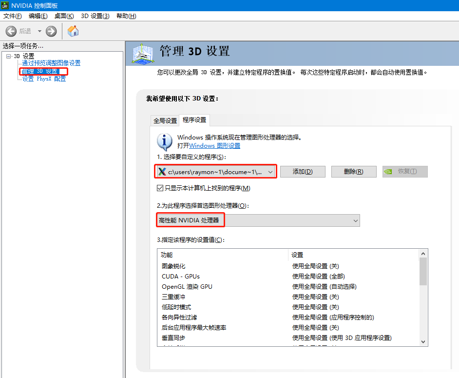
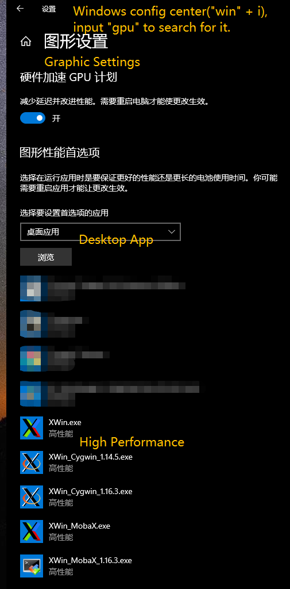

## The purpose of this article

I started using WSL2 on Windows about 1,2 years ago. In the era of WSL1, I did not use WSL because it was not a complete Linux, and WSL2 is very good. It is the most native Linux virtual machine on Windows. It can let you Experience the authentic Linux system.

And because of its very good performance, it can run smoothly even on an ultrabook laptop, and it can be used as a development environment.

Just think about it, you no longer need to start a heavy VMware virtual machine as your development environment, and WSL2 and the Windows system itself also have some integration, for example: In the WSL2 virtual machine, `/mnt/c` is the **C drive** in your Windows system.

I am writing this article now so that I can deploy WSL2 more orderly in the future.

## This is a series of things I will do when I get a brand new Windows 10 computer about setting up the WSL2 environment

👇👇

1. <ins>[Install WSL2](https://docs.microsoft.com/en-us/windows/wsl/install-win10)</ins>

   **Before installing WSL2, update Windows 10 to the latest version.**

   Then you can just use the "Simplified install" approach, by the time so far, this method of is feasible.
   For example:

   `wsl --install -d Ubuntu`
2. <ins>Set up GUI support for WSL2</ins>

   1. [Install Mobaxterm on Windows 10](https://mobaxterm.mobatek.net/download.html)
   2. Do the steps on this document - [Run Linux GUI apps on the Windows Subsystem for Linux (preview)](https://docs.microsoft.com/en-us/windows/wsl/tutorials/gui-apps)

    Since I will not join the **Windows Insiders Program**, so I will not be able to use the built-in Xserver of Windows 10, instead I will use Mobaxterm's Xserver for WSL2.

    After installing the required libraries and apps of the above document, set the environment variables to tell WSL2 to use Mobaxterm's Xserver as followings:

   ```bash
   # On WSL2:
   nano ~/.bashrc
   ```

    Append the following contents🔖:

   ```plaintext
   # Using WSL 2? Then use this instead.
   export DISPLAY="$(/sbin/ip route | awk '/default/ { print $3 }'):0.0"
   export LIBGL_ALWAYS_INDIRECT=1
   ```

    🔖For reference: https://mobaxterm.mobatek.net/documentation.html
    <ins>Search for "**Does MobaXterm X server support OpenGL? How can I use hardware acceleration?**" on the webpage.</ins>

   3. **Open the NVIDIA Control Panel**, configure to use GeForce graphic card as the GPU of Mobaxterm's Xserver.

      
   4. At the same time, the GPU is explicitly specified for Mobaxterm Xserver at the Windows level.

      

      


3. <ins>[Set up VS Code in alliance with WSL2](https://code.visualstudio.com/docs/remote/wsl#_getting-started)</ins>

   💡Strongly recommand you to read the "**Tips and Tricks**" in the above document, there are a bunch of useful SSH related tricks!

## Appendix

### When using WSL2 in a VPN environment, if you encounter a problem that the DNS cannot be resolved normally:

* [Bash loses network connectivity once connected to a VPN](https://docs.microsoft.com/en-us/windows/wsl/troubleshooting#bash-loses-network-connectivity-once-connected-to-a-vpn)
* [WSL 2 Cisco AnyConnect Networking Workaround](https://gist.github.com/b7c03579a5ea55fe431561b502ec1ba8)

    This ☝gist☝ is of great help to me. The script in it is of great reference value and solved the problem that **WSL could not resolve DNS** when I used the **Cisco desktop app**.

    In addition, I also found that if you install **[Cisco Anyconnect through the Microsoft Store](https://www.microsoft.com/en-us/p/anyconnect/9wzdncrdj8lh?activetab=pivot:overviewtab)**, then no additional configuration is required, and WSL2 can also automatically adapt the VPN DNS lookup rules.