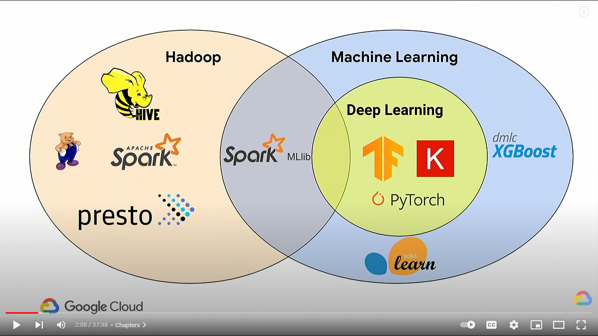
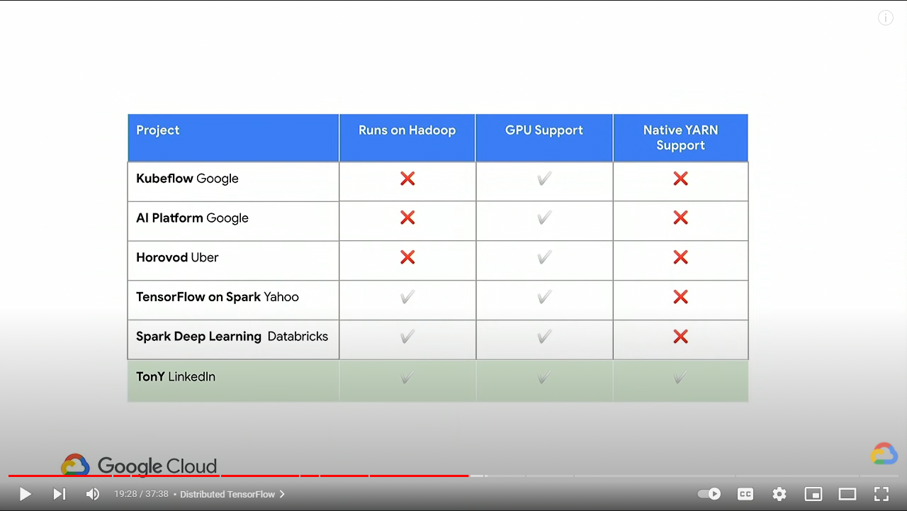

## The purpose of this article

I recently dealt with a service case. This client is exploring how to use XGBoost in CDSW.

I don't understand the basic mechanism of machine learning and deep learning at all, so I took this opportunity to try to search for relevant information.

Soon I found a rich demo project and blog article.

This article attempts to analyze how the XGBoost demo is implemented in CDSW from the perspective of CDSW users without ML/DL knowledge.

While searching for related information on Cloudera, I also discovered how ML/DL workloads are handled on Google Cloud DataProc. I will also try to make a comparison with CDSW.

## Material for this article

* [Cloudera Community: XGBoost demo](https://community.cloudera.com/t5/Community-Articles/Accelerating-ML-models-with-distributed-Xgboost-in-Cloudera/ta-p/293541)
* [How does Dask integrate with HDFS](https://docs.dask.org/en/latest/remote-data-services.html#hadoop-file-system)
* [Github repo of the XGBoost demo](https://github.com/fastforwardlabs/dask_xgboost_parallel)
* [CDSW documentation: Python SDK](https://docs.cloudera.com/cdsw/1.9.2/parallel-computing/topics/cdsw-parallel-computing.html)
* [Cloudera Blog: Implementing distributed model training for deep learning with Cloudera Machine Learning](https://blog.cloudera.com/implementing-distributed-model-training-for-deep-learning-with-cloudera-machine-learning/)
* [Machine Learning with TensorFlow and PyTorch on Apache Hadoop using Cloud Dataproc (Cloud Next '19)](https://youtu.be/hr7_pG3yEOQ)

## How to use XGBoost for distributed model training in Cloudera CDSW? I read the demo code.

I tried to run the [XGBoost demo](https://community.cloudera.com/t5/Community-Articles/Accelerating-ML-models-with-distributed-Xgboost-in-Cloudera/ta-p/293541) here, but in my environment, due to insufficient memory on the Node host, I couldn't successfully run the demo.

The Github repo of the [XGBoost demo code is here](https://github.com/fastforwardlabs/dask_xgboost_parallel). If your CDSW has the ability to access the Internet, you can directly use Git to specify the URL of the repo when creating the Project.

Reference materials for this demo:

1. Cloudera Blog: https://blog.cloudera.com/supercharge-ml-models-with-distributed-xgboost-on-cml/
2. Community article: https://community.cloudera.com/t5/Community-Articles/Accelerating-ML-models-with-distributed-Xgboost-in-Cloudera/ta-p/293541

There are also 2 demo videos in the Community article, which respectively <ins>introduce 1_Dask Parallel Xgboost.ipynb</ins> and <ins>2_Launchdaskschwithdash.py</ins>.
These two are from the source code of the demo repo.

Due to the limited hardware in my environment, I cannot run a complete demo. I can only try my best to share my understanding of the code level of this demo with you for your reference.

First, you need to use the Dockerfile in the demo to create an image, and use this image to create an Engine and Project.

### <ins>0_Datagensynthetic.py</ins> This file is used to generate raw data. The raw data generated will be used for model training.

Code:

```python
for i in range(records):
    ...
```

This segment will generate 8,000,000 records.
Then the generated data will be saved to the winedatagen.csv file in the current Project directory.

### <ins>1_Dask Parallel Xgboost.ipynb</ins>

This Jupyter Notebook file needs to be opened using JupyterLab, so you need to select JupyterLab as the editor when creating a Session.
This file is a demo to specifically create Dask Scheduler and Worker.
In this demo, I read the winedatagen.csv file just created in 0_Datagensynthetic.py. This winedatagen.csv needs to be placed in AWS S3 object storage first.
In order to be read by Dask Worker, a Dask distributed dataframe is constructed.

Code:

```python
import dask.dataframe as dd
import s3fs
df = dd.read_csv("s3://harshalpatil-s3/winedatagen.csv", \
                blocksize="25MB",sample=10000000,dtype={'target': 'int64'})
```

💡 For CDSW users, because this is an on-premise environment, we are usually used to storing files in CDP's HDFS.
This demo does not introduce how to configure Dask to read remote HDFS data.
I looked for the Dask official website. I found out how Dask integrates with HDFS. It is for reference only to combine with your environment.

Dask was installed during the building of the Docker image, and Dask uses PyArrow as the backend to access HDFS, so PyArrow should be installed during the installation process.

It is recommended that you first use the Dockerfile provided by the demo to create a container and use Dask to read the HDFS data under a dev environment.
If there is an error during the operation, it is likely that some Python modules are missing. Then you should build an image based on your needs on top of the Dockerfile from the demo. That is, to install missing packages and OS-level libraries.

<ins>1_Dask Parallel Xgboost.ipynb</ins> This Jupyter Notebook involves the creation of Dask Scheduler and Worker.
In theory, you do not need to modify any code and can run directly. If you need to adjust the scale of the Dask cluster, you can modify the arguments according to your needs.

For example, the code here:

```python
dask_distributed_launch(2,4,8)
```

If you look at the definition of this function, you know that `2`, `4`, and `8` are "**number of workers**", "**nunber of cpu**", and "**number of memory**" respectively.

The Dask cluster created using `(2, 4, 8)` is as follows:

> Scheduler IP: 10.10.15.107 ➡ Dask Scheduler, similar to Resource Manager in YARN and Driver and Cluster Manger in Spark (abstract level).
> Scheduler URL: tcp://10.10.15.107:8786
> 'tcp://10.10.15.107:8786'
>
> \=== List of launched running pods === 
> ===      (scheduler + workers)    === 
>                  Id    IP Address  CPUs  Memory   Status
> 0  74vh857mzu0vizgc  10.10.16.219     4       8  running ➡ Dask Worker
> 1  czd3xgywu6sl3j6p   10.10.0.178     4       8  running ➡ Dask Worker
> 2  gkqtllvakma76z15  10.10.15.107     2       4  running ➡ Dask Scheduler

`dask_test()` This function is used to test whether the basic functions of Dask can run through.

```python
from dask.distributed import Client
client = Client(daskschurl)
```

After these 2 lines of code, the data sets created by the `dask` package are all distributed data sets.
So after `read_csv`, all is a distributed operation based on Dask.

### Summarize:

I think for you, if you have AWS S3, this demo can run to completion without having to change the code.
If you need to use HDFS as the storage of sample data, you need to refer to Dask's official documentation to modify the part of the code that reads the data, and the other parts should not need to be changed.

`dask_distributed_launch` This function uses the [Python SDK provided by CDSW](https://docs.cloudera.com/cdsw/1.9.2/parallel-computing/topics/cdsw-parallel-computing.html) to create Pods, which are provided to Dask as a Scheduler and Workers.

Specifically related to the two interfaces:

* `cdsw.launch_workers`
* `cdsw.list_workers`

For more details about CDSW's Python SDK, you can refer to [CDSW's official website](https://docs.cloudera.com/cdsw/1.9.2/parallel-computing/topics/cdsw-parallel-computing.html) and another [Cloudera Blog article on how to use this SDK](https://blog.cloudera.com/implementing-distributed-model-training-for-deep-learning-with-cloudera-machine-learning/).

### Digression: Comparison between Dataproc's ML/DL landing and CDSW.

Let's first look at the intersection of Hadoop and ML/DL defined by Google.

From the figure, we can see that in the traditional big data ecosystem, only Spark MLlib is involved in ML, and there is no project in the field of DL that has native support with Hadoop.



There are actually some projects on the market that are exploring the integration of ML/DL with Hadoop.
For example, in the figure below, we can see the support of the products and projects of different companies for Hadoop, GPU Support, and Native YARN Support.



While both the two are products from Google Cloud, Dataproc seems to have more capabilities than AI Platform.
Although I think it seems a bit inappropriate to compare the open source project Kubeflow, this reflects Google's confidence in technology.

In contrast, for the application of ML/DL, Dataproc can be regarded as a fusion of CDP + CDSW.
The life process of ML and DL applications is roughly divided into the following 3 steps:

1. Collection and processing of raw data
2. Model training
3. Serving the model

CDSW obviously does not have native YARN support, which pales in comparison with Dataproc.
However, CDSW has good scalability, such as Data Visualization, combined with the use of custom Docker images, and deployment of custom applications.
These are based on the dividends of Kubernetes as an abstract design that better accommodates all kinds of workloads compared to YARN.
I have to say that CDSW is like a sparrow, small but complete.