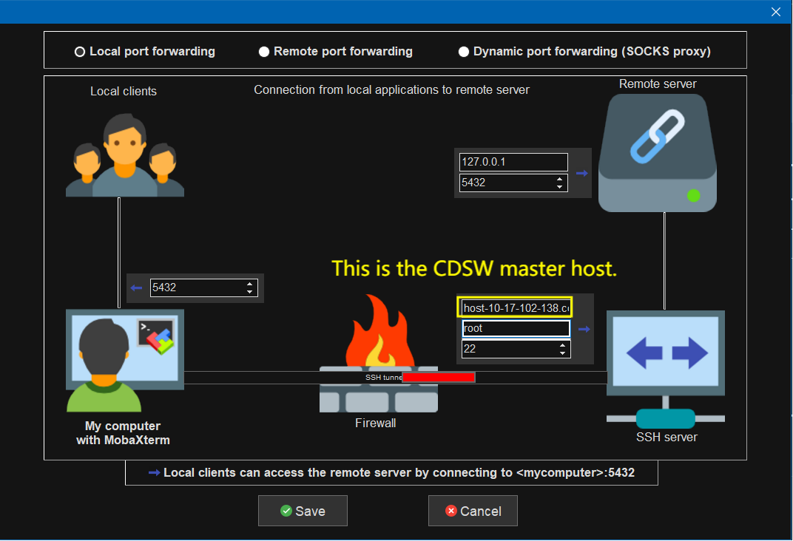
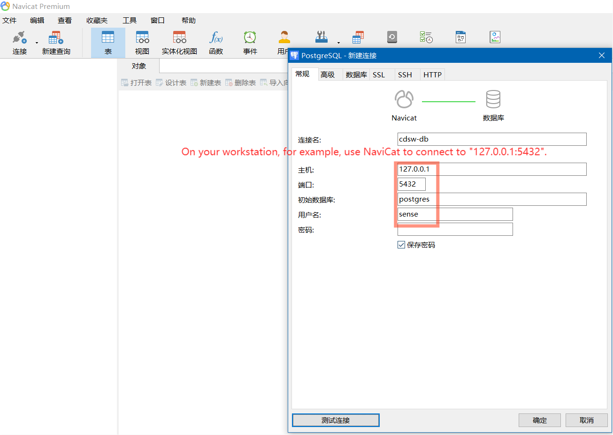
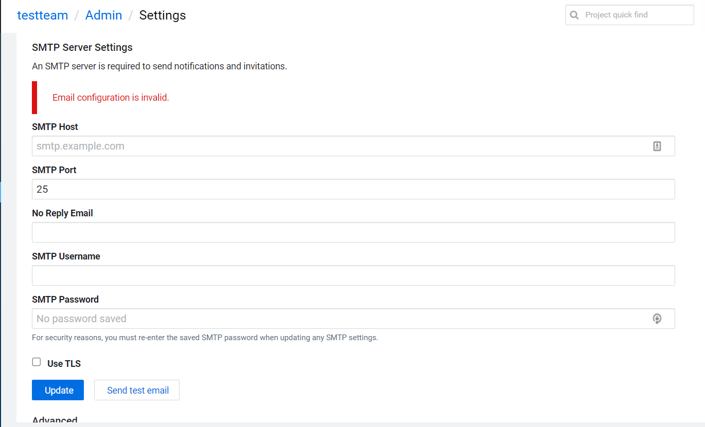
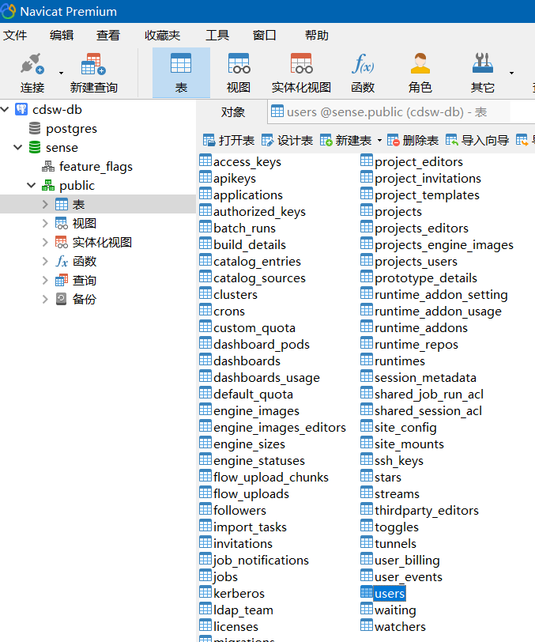
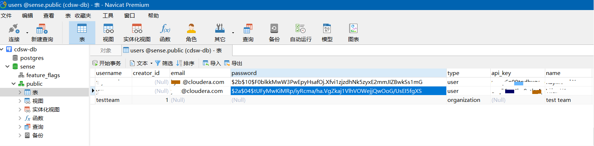

<!--StartFragment-->

* How to connect to CDSW database using `kubectl exec`?
* How to forward the database service of CDSW to the host?
* Change user's password if you cannot set up smtp service to change password

First of all, we need to know that in CDSW/Kubernetes, we use SDN (Software Defined Network) to create a network that is only used by Pod/Service within the cluster. For example, the IP CIDR used by the CDSW nodes is: **192.168.0.0/24**. Then the Pod IP CIDR used by CDSW/Kubernetes will generally not overlap with **192.168.0.0/24**, such as: **100.66.0.0/16**.

```shell
kubectl cluster-info dump | grep -m 1 cluster-cidr
#                             "--cluster-cidr=100.66.0.0/16",
```

<!--EndFragment-->

<!--StartFragment-->

## How to connect to CDSW database using `kubectl exec`?

For how to connect to CDSW database, you can refer to this [official documentation](https://docs.cloudera.com/cdsw/1.9.1/monitoring/topics/cdsw-monitoring-user-events.html).

```shell
CDSW_NAMESPACE="default" # All CDSW internal applications are running in "default" NameSpace.
db_pod=$(kubectl get pods --selector=role=db --namespace=${CDSW_NAMESPACE} -o jsonpath='{.items[*].metadata.name}')
echo $db_pod
# db-69fcf7b6fc-6glpq
db_user=$(kubectl get secrets/internal-secrets --namespace=${CDSW_NAMESPACE} -o 'go-template={{index .data "postgresql.user"}}' | base64 -d)
echo $db_user
# sense
kubectl exec $db_pod -ti -- psql -U $db_user
```

<!--EndFragment-->

<!--StartFragment-->

## How to forward the database service of CDSW to the host?

As I introduced at the beginning, the Pod CIDR and Service CIDR used by Kubernetes are isolated from our host's network. Now that I want to access this database from the host, I need to forward the traffic to the host. Because I want to use tools such as NaviCat to explore what information is in the database.

```shell
kubectl --namespace=default get services | sed -rn '1p;/db/Ip'
# NAME                         TYPE        CLUSTER-IP       EXTERNAL-IP   PORT(S)                                         AGE
# db                           ClusterIP   100.77.124.190   <none>        5432/TCP                                        23h
kubectl --namespace=default port-forward service/db 5432:5432
# Forwarding from 127.0.0.1:5432 -> 5432
```

Then you can use for example, Mobaxterm, to forward this port again to your workstation. Because CDSW PostgresSQL database will verify the source IP of connection, if it isn't 127.0.0.1, it will refuse the connection.



Then you can use for example, NaviCat, to connect to 127.0.0.1:5432.



<!--EndFragment-->

<!--StartFragment-->

## Change user's password if you cannot set up smtp service to change password

Now we can use NaviCat to explore the CDSW database. One of my customer says, they are using CDSW in a internal network environment, so they cannot set up a SMTP server to use email service.



In this case, we can change the password directly inside CDSW database.



Because the password is encrypted by **Bcrypt** algorithm, we can use [this website](https://www.devglan.com/online-tools/bcrypt-hash-generator) to generate a new password and update the **"public"."users"** table.

P.S. : You should use "4" as number of rounds of Bcrypt Hash.



The DML statement as below:

```sql
UPDATE "public"."users" SET "password" = '$2a$04$tUFyMwKiMRp/iyRcma/ha.VgZkaj1VlhVOWejjQwOoG/UsEI5fgXS' WHERE "id" = 3
```

- - -

That's all for port forwarding a service of CDSW, and changing the user password of CDSW. Thank you for reading.

<!--EndFragment-->