# Store and Protect Cluster Data - Work with Volumes

## 5.1.1: Review: Data Fabric FS Structures - Overview of Volumes

Let's take a look at the storage architecture behind the map - our distributed file and object-store.

A cluster is made up of nodes and each node contains a number of disks.

Disks are considered combined into storage pools with a default size
 of three disks.

Typically each node will have several storage pools.
When data is written. It is striped across the disks in a single storage pool into logical constructs called containers.
Each storage pool holds many containers.

Containers, simply hold files and metadata and they are transparent to users and applications. 

Data containers hold the actual files and name containers primarily hold the metadata.
Containers are sized automatically and spread throughout the cluster.
By default, they will grow to about 32 gigabytes.

When a client writes a file to the cluster, the file is first sharded into chunks.
By default, a chunk is 256 megabytes.
The first chunk is written to a container as a series of eight-kilobyte blocks.
All of the blocks in one chunk are written continuously to a single container.
As the chunk is written, the data is simultaneously replicated. The replication chain length is configurable from one to six.

This example uses the default value of three.

The first container at chunk is written to, is referred to as its master container.
The data is replicated to a second container called the intermediate container which will be in a different storage pool on a different node.
Finally, the chunk is replicated to a tail container only after all replicas have a copy of the data.

The next chunk is written and replicated in the same manner.
The second chunk may or may not start in a different master container from the first chunk.

Blocks are written contiguously into the same container but chunks are written to different containers. So when the file is completely written.
The chunks that make up a file will be distributed throughout the cluster.
Finally, containers are stored in volumes.

Volumes are a logical data management entity allowing you to apply policies, quotas, and permissions to logical groups of data.
A container and all of its replicas will always be in the same volume. Though, as you can see, a volume may spread throughout the entire cluster.

## 5.2.1: Topology - Volume Placement (Topology)

A cluster's topology defines logical groups of nodes in your cluster.
There is no single correct formula for defining node topology. 

It will be based on your site's specific configuration and your data access
policies.
But if nothing else you should use topology to tell MapR which nodes are in which racks.

### Node Topology

Node topologies are hierarchical labels that group nodes together.

Topology paths are written much like file system directories but they
are not mounted points or directories.
They simply label that group of nodes together and illustrate the relationship between groups of nodes.

The default topology is "/data/default-rack". As nodes are added to the cluster, they are assigned to that topology by default.

### Volume Topology

Volume topologies identify which node topologies the volume can write to.

The default topology assigned to volumes is "/data".

Notice that the "/data" topology includes all of the nodes in the
 "/data/default-rack" topology because "/data/default-rack" is a sub-topology of "/data".

If you haven't made any changes to the default topology, this means that the volumes data can be written or replicated to any node in the cluster.

On the surface that doesn't seem like such a bad plan. The point of a distributed file system is after all to distribute data.

### Rack Awareness

Problem: MapR does not know which nodes are in different racks.

However, with all of the default topologies in place, MapR has no knowledge of which nodes are located in different racks.
Let's look at exactly why this could be a problem.

## 5.2.3: Default Topology and Replication

When MapR FS replicates data, it will always replicate to different nodes to spread out the risk of data loss.

It has knowledge of where all the nodes are so this is not a problem.
lt will also replicate to different sub-topologies or racks if they are defined.
In the default assignment, MapR puts all nodes in a single topology.

With this single topology configuration, MapR FS doesn't have any way to determine which nodes are in different racks.

It looks to MapR FS as if all of the nodes are in one big rack.

Without defined sub-topologies.
It's possible for a master container and all of its replicas to be on nodes that are all in the same rack.

This reduces the fault tolerance of your cluster.

If one rack goes down and all replicas are on nodes in that rack.
Then your data is unavailable until the rack is put back into service.

A better strategy is to create sub-topologies to define the different racks with nodes assigned appropriately.

Here, there are four racks, each with its own sub-topology still under "/data".

Volumes will still by default go to the  "/data" topology in this example, they can again go to any node in the cluster, but now MapR FS will automatically replicate the volumes containers to different sub-topologies which spreads the data out over different racks.

In this configuration, assigning a volume to the "/data/rack1" topology would limit the volume's data to the nodes in rack One.

Defeating the purpose of defining separate rack topologies.

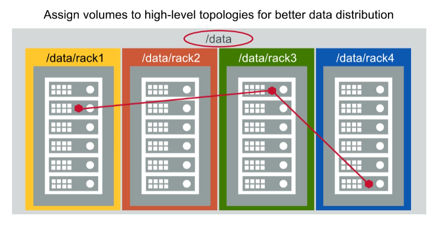

In general, it's best to assign higher-level topologies to volumes to
provide the greatest flexibility for data placement and replication.

## 5.2.4: Rack Topology and Virtual Nodes

* If MapR nodes are virtual, it’s possible that all nodes will be launched on the same physical host
* Check with your cloud provider to make sure MapR nodes are on different physical nodes

Note that if your MapR nodes are virtual nodes such as those
launched through Amazon Web Services, it's possible that your virtual
nodes will all be launched on the same physical host.

If you're using virtual nodes for production data.
You should check with your cloud provider to make sure that the virtual machines in your MapR cluster are not all hosted on the same node.

## 5.2.6: Topology Strategies

### 1. Failure Domains

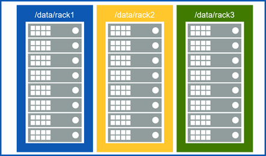

Segregate points of failure, such as racks or power drops.

### 2. Hardware Specifications

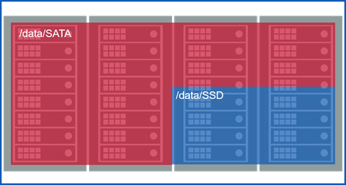

Group nodes according to their specifications.

### 3. Department

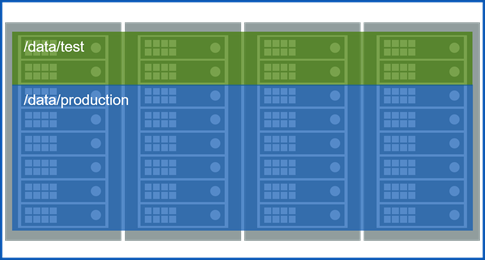

Allocate nodes to departments.

### 4. Rack Awareness

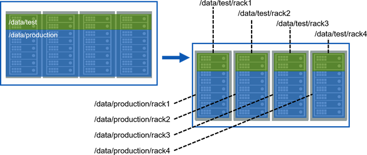

Your topology should incorporate rack awareness.

## 5.2.7: Best Practices

There are a few best practices for volume topology.

* Do not assign volumes to the "/" topology. You may want to move nodes to a topology that no volume can write to

    First, don't assign volumes to the "/" topology, as you will learn in lesson 11.
    You may want to move nodes into a topology that no volume can write to, for maintenance or decommissioning.
* Use high-level topologies, such as /data, for volumes

    Second, use high-level topologies for most volumes so they're replicated throughout the cluster.
    The default topology for volumes is "/data" and in most cases this is inappropriate.
* Use lower-level topologies only if required to constrain data placement

  * Isolate departmentsal data
  * Isolate based on performance requirements

    Finally use lower-level topologies only, if you have to constrain data placement to a smaller set of nodes.
    Two examples of when this might be required are: if you need to make sure that data from two different departments do not coexist on the same node or if you need certain volumes placed on high-performing nodes.

## 5.3.1: Attributes for Standard Volumes - Volume Attributes

* Properties – general information about the volume
* Authorization – who can do what
* Usage –  how much space the volume can use

Volume attributes are divided into four categories: properties, authorization, usage, and schedules.
We'll talk about the first three in this lesson and cover schedules when we talk about snapshots and mirrors in the next two lessons.

## 5.3.2: Properties

### 1. Name and Mount Path

Name and Mount Path

<ins>Mount path is relative to the root of the cluster file system</ins>

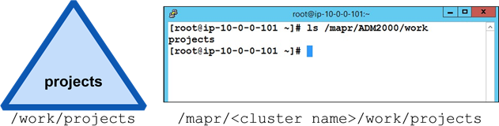

* Name: projects
* Mount path: /work/projects

The only attribute you must supply for a standard volume is its name, which must be unique.

Typically, you will also mount the volume and set a mount path.
If the volume is mounted and the node is running the NFS service you will be able to see the volume in the cluster file system on the Linux side.

The volume mount path is relative to where the cluster file system is mounted, which is "/mapr/{cluster_name}" by default.

### 2. Accountable Entity (AE)

Accountable Entity (AE)

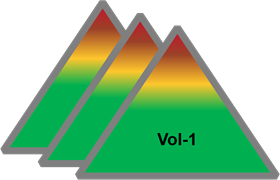

* Entity (user or group) accountable for a volume's usage
* Only one AE per volume

  * Default is MapR admin user (mapr)
* Track disk usage for shared clusters

The accountable entity is the user or group accountable for a volume's usage.
There can only be one accountable entity per volume.

The primary purpose for assigning accountable entities is to track disk usage for shared clusters.

If you have no need to track how much storage different users or groups are consuming. You can simply leave the accountable entity set to the default.

### 3. Wire Encryption

Wire Encryption

Whether the volume’s data traffic should be encrypted

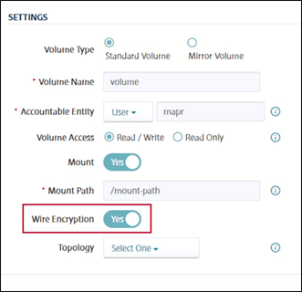

If the cluster is installed in the secure mode.
You can enable or disable wire encryption on the volumes.
When wire encryption is enabled, data traffic using that volume is encrypted.

### 4. Topology

Topology

Which node topology a volume’s data can be written to (/data is the default)

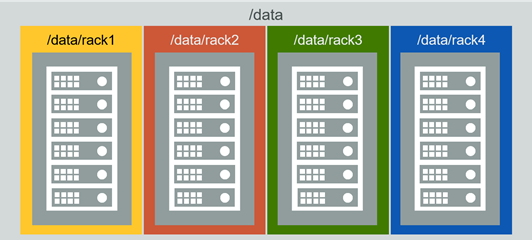

The topology defines which nodes the volumes data can be written to.
If you do not specify a topology, the default value of "/data" is used.

### 5. Replication Type

Replication Type

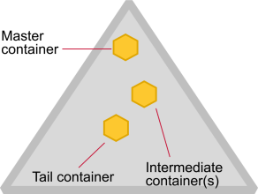

* Once set, cannot change
* High throughput (chain)

  * Default
  * Appropriate for most volumes

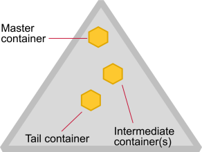

* Low latency (star)

  * Best with small files
  * Can impact network with large files

There are two replication types or patterns.
Once a replication pattern is selected for a volume, it cannot be changed.
The default replication pattern is: from the master container to the intermediate container and then from the intermediate container to the tail container.
This pattern is appropriate for most user volumes and is optimized for high
throughput.

You can optionally select replication that is optimized for low latency.
If you select low latency then both the intermediate and tail containers are replicated from the master container.

Low latency should only be used if your volume contains smaller files or if the network can handle the additional bandwidth of creating both copies
at the same time from the same master container.
Note that the name container always uses low latency of replication and that cannot be changed.