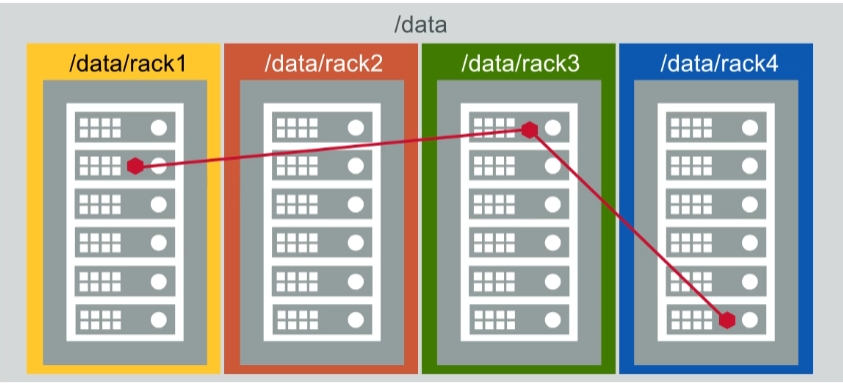

# Store and Protect Cluster Data - Work with Volumes

## 5.1.1: Review: Data Fabric FS Structures - Overview of Volumes

Let's take a look at the storage architecture behind the map - our distributed file and object-store.

A cluster is made up of nodes and each node contains a number of disks.

Disks are considered combined into storage pools with a default size
 of three disks.

Typically each node will have several storage pools.
When data is written. It is striped across the disks in a single storage pool into logical constructs called containers.
Each storage pool holds many containers.

Containers, simply hold files and metadata and they are transparent to users and applications. 

Data containers hold the actual files and name containers primarily hold the metadata.
Containers are sized automatically and spread throughout the cluster.
By default, they will grow to about 32 gigabytes.

When a client writes a file to the cluster, the file is first sharded into chunks.
By default, a chunk is 256 megabytes.
The first chunk is written to a container as a series of eight-kilobyte blocks.
All of the blocks in one chunk are written continuously to a single container.
As the chunk is written, the data is simultaneously replicated. The replication chain length is configurable from one to six.

This example uses the default value of three.

The first container at chunk is written to, is referred to as its master container.
The data is replicated to a second container called the intermediate container which will be in a different storage pool on a different node.
Finally, the chunk is replicated to a tail container only after all replicas have a copy of the data.

The next chunk is written and replicated in the same manner.
The second chunk may or may not start in a different master container from the first chunk.

Blocks are written contiguously into the same container but chunks are written to different containers. So when the file is completely written.
The chunks that make up a file will be distributed throughout the cluster.
Finally, containers are stored in volumes.

Volumes are a logical data management entity allowing you to apply policies, quotas, and permissions to logical groups of data.
A container and all of its replicas will always be in the same volume. Though, as you can see, a volume may spread throughout the entire cluster.

## 5.2.1: Topology - Volume Placement (Topology)

A cluster's topology defines logical groups of nodes in your cluster.
There is no single correct formula for defining node topology. 

It will be based on your site's specific configuration and your data access
policies.
But if nothing else you should use topology to tell MapR which nodes are in which racks.

### Node Topology

Node topologies are hierarchical labels that group nodes together.

Topology paths are written much like file system directories but they
are not mounted points or directories.
They simply label that group of nodes together and illustrate the relationship between groups of nodes.

The default topology is "/data/default-rack". As nodes are added to the cluster, they are assigned to that topology by default.

### Volume Topology

Volume topologies identify which node topologies the volume can write to.

The default topology assigned to volumes is "/data".

Notice that the "/data" topology includes all of the nodes in the
 "/data/default-rack" topology because "/data/default-rack" is a sub-topology of "/data".

If you haven't made any changes to the default topology, this means that the volumes data can be written or replicated to any node in the cluster.

On the surface that doesn't seem like such a bad plan. The point of a distributed file system is after all to distribute data.

### Rack Awareness

Problem: MapR does not know which nodes are in different racks.

However, with all of the default topologies in place, MapR has no knowledge of which nodes are located in different racks.
Let's look at exactly why this could be a problem.

## 5.2.3: Default Topology and Replication

When MapR FS replicates data, it will always replicate to different nodes to spread out the risk of data loss.

It has knowledge of where all the nodes are so this is not a problem.
lt will also replicate to different sub-topologies or racks if they are defined.
In the default assignment, MapR puts all nodes in a single topology.

With this single topology configuration, MapR FS doesn't have any way to determine which nodes are in different racks.

It looks to MapR FS as if all of the nodes are in one big rack.

Without defined sub-topologies.
It's possible for a master container and all of its replicas to be on nodes that are all in the same rack.

This reduces the fault tolerance of your cluster.

If one rack goes down and all replicas are on nodes in that rack.
Then your data is unavailable until the rack is put back into service.

