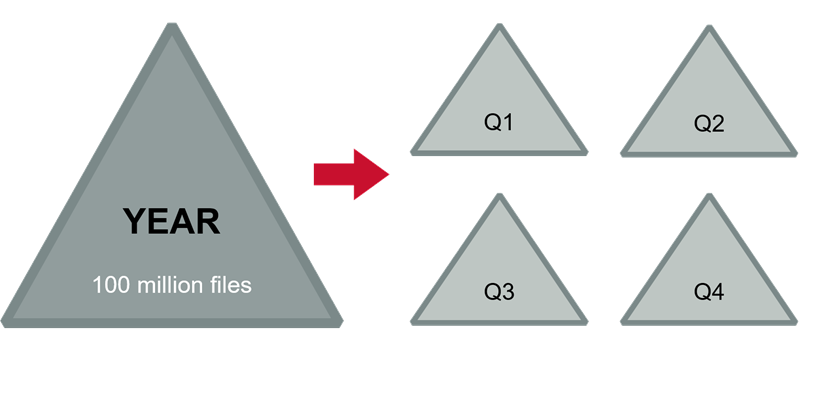

This article is a transcrption of one of the courses from HPE Ezmeral Learn On-Demand.

The original course is free to learn, only need to register for an account.
If you are interesting in HPE Ezmeral Data Fabric (known as MapR platform before), recommend you to take a look here 🔗 https://learn.ezmeral.software.hpe.com/store-and-protect-cluster-data

# Store and Protect Cluster Data - Work with Volumes

## 5.1.1: Review: Data Fabric FS Structures - Overview of Volumes

Let's take a look at the storage architecture behind the MapR distributed file and object-store.

A cluster is made up of nodes and each node contains a number of disks.

Disks are considered combined into storage pools with a default size
 of three disks.

Typically each node will have several storage pools.
When data is written. It is striped across the disks in a single storage pool into logical constructs called containers.
Each storage pool holds many containers.

Containers, simply hold files and metadata and they are transparent to users and applications. 

Data containers hold the actual files and name containers primarily hold the metadata.
Containers are sized automatically and spread throughout the cluster.
By default, they will grow to about 32 gigabytes.

When a client writes a file to the cluster, the file is first sharded into chunks.
By default, a chunk is 256 megabytes.
The first chunk is written to a container as a series of eight-kilobyte blocks.
All of the blocks in one chunk are written continuously to a single container.
As the chunk is written, the data is simultaneously replicated. The replication chain length is configurable from one to six.

This example uses the default value of three.

The first container at chunk is written to, is referred to as its master container.
The data is replicated to a second container called the intermediate container which will be in a different storage pool on a different node.
Finally, the chunk is replicated to a tail container only after all replicas have a copy of the data.

The next chunk is written and replicated in the same manner.
The second chunk may or may not start in a different master container from the first chunk.

Blocks are written contiguously into the same container but chunks are written to different containers. So when the file is completely written.
The chunks that make up a file will be distributed throughout the cluster.
Finally, containers are stored in volumes.

Volumes are a logical data management entity allowing you to apply policies, quotas, and permissions to logical groups of data.
A container and all of its replicas will always be in the same volume. Though, as you can see, a volume may spread throughout the entire cluster.

## 5.2.1: Topology - Volume Placement (Topology)

A cluster's topology defines logical groups of nodes in your cluster.
There is no single correct formula for defining node topology. 

It will be based on your site's specific configuration and your data access
policies.
But if nothing else you should use topology to tell MapR which nodes are in which racks.

### Node Topology

Node topologies are hierarchical labels that group nodes together.

Topology paths are written much like file system directories but they
are not mounted points or directories.
They simply label that group of nodes together and illustrate the relationship between groups of nodes.

The default topology is "/data/default-rack". As nodes are added to the cluster, they are assigned to that topology by default.

### Volume Topology

Volume topologies identify which node topologies the volume can write to.

The default topology assigned to volumes is "/data".

Notice that the "/data" topology includes all of the nodes in the
 "/data/default-rack" topology because "/data/default-rack" is a sub-topology of "/data".

If you haven't made any changes to the default topology, this means that the volumes data can be written or replicated to any node in the cluster.

On the surface that doesn't seem like such a bad plan. The point of a distributed file system is after all to distribute data.

### Rack Awareness

Problem: MapR does not know which nodes are in different racks.

However, with all of the default topologies in place, MapR has no knowledge of which nodes are located in different racks.
Let's look at exactly why this could be a problem.

## 5.2.3: Default Topology and Replication

When MapR FS replicates data, it will always replicate to different nodes to spread out the risk of data loss.

It has knowledge of where all the nodes are so this is not a problem.
lt will also replicate to different sub-topologies or racks if they are defined.
In the default assignment, MapR puts all nodes in a single topology.

With this single topology configuration, MapR FS doesn't have any way to determine which nodes are in different racks.

It looks to MapR FS as if all of the nodes are in one big rack.

Without defined sub-topologies.
It's possible for a master container and all of its replicas to be on nodes that are all in the same rack.

This reduces the fault tolerance of your cluster.

If one rack goes down and all replicas are on nodes in that rack.
Then your data is unavailable until the rack is put back into service.

A better strategy is to create sub-topologies to define the different racks with nodes assigned appropriately.

Here, there are four racks, each with its own sub-topology still under "/data".

Volumes will still by default go to the  "/data" topology in this example, they can again go to any node in the cluster, but now MapR FS will automatically replicate the volumes containers to different sub-topologies which spreads the data out over different racks.

In this configuration, assigning a volume to the "/data/rack1" topology would limit the volume's data to the nodes in rack One.

Defeating the purpose of defining separate rack topologies.

In general, it's best to assign higher-level topologies to volumes to
provide the greatest flexibility for data placement and replication.

## 5.2.4: Rack Topology and Virtual Nodes

* If MapR nodes are virtual, it’s possible that all nodes will be launched on the same physical host
* Check with your cloud provider to make sure MapR nodes are on different physical nodes

Note that if your MapR nodes are virtual nodes such as those
launched through Amazon Web Services, it's possible that your virtual
nodes will all be launched on the same physical host.

If you're using virtual nodes for production data.
You should check with your cloud provider to make sure that the virtual machines in your MapR cluster are not all hosted on the same node.

## 5.2.6: Topology Strategies

### 1. Failure Domains

Segregate points of failure, such as racks or power drops.

### 2. Hardware Specifications

Group nodes according to their specifications.

### 3. Department

Allocate nodes to departments.

### 4. Rack Awareness

Your topology should incorporate rack awareness.

## 5.2.7: Best Practices

There are a few best practices for volume topology.

* Do not assign volumes to the "/" topology. You may want to move nodes to a topology that no volume can write to

    First, don't assign volumes to the "/" topology, as you will learn in lesson 11.
    You may want to move nodes into a topology that no volume can write to, for maintenance or decommissioning.
* Use high-level topologies, such as /data, for volumes

    Second, use high-level topologies for most volumes so they're replicated throughout the cluster.
    The default topology for volumes is "/data" and in most cases this is inappropriate.
* Use lower-level topologies only if required to constrain data placement

  * Isolate departmentsal data
  * Isolate based on performance requirements

    Finally use lower-level topologies only, if you have to constrain data placement to a smaller set of nodes.
    Two examples of when this might be required are: if you need to make sure that data from two different departments do not coexist on the same node or if you need certain volumes placed on high-performing nodes.

## 5.3.1: Attributes for Standard Volumes - Volume Attributes

* Properties – general information about the volume
* Authorization – who can do what
* Usage –  how much space the volume can use

Volume attributes are divided into four categories: properties, authorization, usage, and schedules.
We'll talk about the first three in this lesson and cover schedules when we talk about snapshots and mirrors in the next two lessons.

## 5.3.2: Properties

### 1. Name and Mount Path

Name and Mount Path

<ins>Mount path is relative to the root of the cluster file system</ins>

* Name: projects
* Mount path: /work/projects

The only attribute you must supply for a standard volume is its name, which must be unique.

Typically, you will also mount the volume and set a mount path.
If the volume is mounted and the node is running the NFS service you will be able to see the volume in the cluster file system on the Linux side.

The volume mount path is relative to where the cluster file system is mounted, which is "/mapr/{cluster_name}" by default.

### 2. Accountable Entity (AE)

Accountable Entity (AE)

* Entity (user or group) accountable for a volume's usage
* Only one AE per volume

  * Default is MapR admin user (mapr)
* Track disk usage for shared clusters

The accountable entity is the user or group accountable for a volume's usage.
There can only be one accountable entity per volume.

The primary purpose for assigning accountable entities is to track disk usage for shared clusters.

If you have no need to track how much storage different users or groups are consuming. You can simply leave the accountable entity set to the default.

### 3. Wire Encryption

Wire Encryption

Whether the volume’s data traffic should be encrypted

If the cluster is installed in the secure mode.
You can enable or disable wire encryption on the volumes.
When wire encryption is enabled, data traffic using that volume is encrypted.

### 4. Topology

Topology

Which node topology a volume’s data can be written to (/data is the default)

The topology defines which nodes the volumes data can be written to.
If you do not specify a topology, the default value of "/data" is used.

### 5. Replication Type

Replication Type

* Once set, cannot change
* High throughput (chain)

  * Default
  * Appropriate for most volumes

* Low latency (star)

  * Best with small files
  * Can impact network with large files

There are two replication types or patterns.
Once a replication pattern is selected for a volume, it cannot be changed.
The default replication pattern is: from the master container to the intermediate container and then from the intermediate container to the tail container.
This pattern is appropriate for most user volumes and is optimized for high
throughput.

You can optionally select replication that is optimized for low latency.
If you select low latency then both the intermediate and tail containers are replicated from the master container.

Low latency should only be used if your volume contains smaller files or if the network can handle the additional bandwidth of creating both copies
at the same time from the same master container.
Note that the name container always uses low latency of replication and that cannot be changed.

### 6. Target Replication

Replication Type

* Total number you want of each container 
* From 2 to 6 (default is 3)
* Name and data containers can have different values
* If actual replication count falls below this, data is re-replicated after a defined interval

Target replication is the total number of copies you want of each container. The default is three.
Different volumes can have different replication targets, each volume can also have a different target for its name container and for its data containers.

If the actual replication count falls below the target replication, the data will automatically be re-replicated after a defined interval, by default one hour. This gives a node or storage pool the chance to come back online and re-establish the replica count before undertaking the somewhat expensive operation of re-replication.

### 7. Minimum Replication

Replication Type

* Minimum number needed of each container
* From 1 to 5 (default is 2)
* Name and data containers can have different values
* If actual replication count falls below this, an alarm is raised and data is re-replicated immediately

The minimum replication is the total number of copies you must have
of each container.
The default is two. If the actual replication falls below the minimum replication factor, an alarm is raised and data replication begins immediately.

## 5.3.3: Authorization

### 1. Volume Permissions

Volume Permissions

Volume permissions can be granted to users or groups

Volume permissions specify what operations users and groups can perform on MapR volumes.
Permission codes allow users and groups to dump or back up the volume mirror or restore the volume, modify volume properties, delete the volume, or review and edit volume permissions.

### 2. Root Directory Permission

Root Directory Permission

* Defines who can read and write data in the volume
* Works in conjunction with user access controls

Root directory permissions are unique style, read write and execute permissions for owner, group and other by default.
The owner is the user who created the volume.
These permissions define who can read and write data in the volume.
They work in conjunction with user access controls which are defined next.

### 3. User Access Controls

User Access Controls

* Access Control Expressions allow granular control over permissions
* Use expressions to include or exclude by user, group, or role

User access controls allow you to define very granular permissions rather than just assigning read/write or execute permissions in the standard unit scheme of owner, group and other.

You can use access control expressions or aces to include or exclude permissions for a single user or for a group or even for a role that you define.
Access control expressions are covered in more detail in a later lesson.

## 5.3.5: Usage: Quotas

### 1. Quota Types

Volume quotas allow you to restrict the size of a single volume and can be set at any time.

When the advisory quota is reached, an alarm is raised but data continues to be written to the volume.

When the hard quota is reached, no more data will be written to the volume.
It is important to respond to advisory quota alarms to avoid impacting operations to the volume.

### 2. What Counts?

* `10 GB source file :   10 GB`
* `Compressed to 8 GB:   8 GB (8 GB counts against quota)`
* `Replicated 3 times:   24 GB`

When measuring disk usage only the space actually consumed by the first copy of the data accounts.

For example, suppose a 10-gigabyte file is compressed to 8 gigabytes.
When it's written, the file has a replication factor of three, so it consumes 24 gigabytes of disk space.
However, only the first eight gigabytes are counted against the quota.

## 5.4.1: Typical Volume Layout - Design a Volume Plan

Some volumes are created automatically when you install a cluster.
For example, "opt", "user" and "mapr.var".
A directory for the user "mapr" is also created automatically.
You want to create your own volumes depending on your organization's structure and needs.
Volumes of organizations.
Typically create include things like projects or volumes for specific users.
You need to plan out what your volume layout will look like your business needs.

Some volumes are created automatically.

Create additional volumes based on your business needs.

## 5.4.2: Manage Data with Volumes

The primary purpose of volumes is for data management.
Volumes are used to easily set different policies and standards for different sets of data.
This includes setting up access permissions and forcing disk limits or billing departments or teams for the storage they use.
Different groups of data also often have different replication or encryption needs.
Snapshots and mirrors, which are discussed in more detail.
They are taken at the volume level. If you only had a single volume for all of your cluster data, you could only mirror or snapshot the entire cluster, which is not practical.

Use volumes to:

* Establish ownership and accountability

  * standardize access permissions
  * enforce disk use limits
  * provide multi-tenant billing
* Set replication policies
* Assign encryption polices
* Efficiently use snapshots and mirrors

## 5.4.3: Volumes Example

Here's an example of how things might look in practice.
The engineering department has several volumes.
The accountable entity for all the volumes is the engineering group which allows engineering to be built for the space it uses.
Only the engineering group has access to this data.

Production data is critical so it's replicated five times and also encrypted.
Since a 5x replication factor can consume a lot of disk space.
You probably don't want all of your data replicated this way.

Test data requires frequent snapshots for quick recovery in case testing has an unexpected impact on the data.
Also, everyone needs to have read access to the test data.

Some files need to be mirrored to overseas locations for deployment.
Since mirroring overseas can be expensive.
Put only the required data in a single volume so you are not mirroring more than you need to.

## 5.4.4: Volumes Best Practices

* Create volumes based on business requirements and practices
* Create multiple volumes for users, departments, projects, etc.
* Consider practical limitations on volume size

For best results, create volumes based on your business requirements and practices and create multiple volumes.
In general, more volumes is better for data distribution.
While the MapR architecture doesn't prevent you from creating a small number of very large volumes, there are some practical limits you should be aware of, which we'll discuss next.

## 5.4.6: Name Containers vs. Data Containers

| Data Container                                   | Name Container                                         |
| ------------------------------------------------ | ------------------------------------------------------ |
| Stores data                                      | Stores metadata, and the first 64 KB of every file     |
| Many (possibly millions) per volume              | Only one per volume                                    |
| Size automatically managed (default about 32 GB) | Size limited only by the storage pool where it resides |

Recall from earlier in this lesson that each volume has many data containers, but only a single name container. 
The name container stores metadata for all of the files in the volume and also stores the 1st 64 kilobytes of each file. 

MapR automatically manages the size and number of data containers, but the size of the single name container is limited only by the size of the storage pool where it resides.

## 5.4.7: Name Container Sizing

* Name container resides on a single storage pool
* Other containers will likely also be on that storage pool
* No more volume data can be written if the name container is out of space
* Since storage pools are generally uniform in size, the Data Fabric can’t relocate the name container to make more room

When we say that the name container is bounded only by the size of the storage pool where it resides, keep in mind that there are likely other containers from this or other volumes on that storage pool.

So for example, if you have a two-terabyte storage pool, a volume's name container will only get a portion of that space. 

If the name container runs out of room, no additional data can be written to that volume. 

And since storage pools are generally about the same size across the cluster, there likely won't be a storage pool with more room than the name container could be moved to. 

A general recommendation is to keep name containers at or below 256 gigabytes. 

The way to limit the size of a named container is to create more volumes because each new volume gets a new name container.

## 5.4.8: Files per volume

What does this translate to as far as the number of files per volume? 

Remember that the name container stores the 1st 64 kilobytes of every file, so the size of the name container will be the number of files in the volume times 64 K.

Conversely, the maximum number of files per volume should be the maximum size you want for the name container divided by 64 K. 

For example, you could store 4,000,000 files that are 64 K or larger in a volume before the name container would exceed 256 gigabytes. 

The picture is different if you were storing many small files. 

The block size for chunks is 8 kilobytes, so even storing a four-kilobyte file will occupy 8 kilobytes of space. 

If all your files are 8K or smaller, the size of the name container will be the number of files times 8K. 

Flipping the equation again, the maximum files for a volume would be the maximum size you want for your name container divided by 8K.

In this scenario, you could store 32 million files in a volume before the name container would exceed 256 gigabytes.

## 5.4.9: Control Name Container Size

1. Estimate number and size of files
2. Determine maximum files for name container
3. Create volumes that will store the required amount of data

When planning your volumes, first estimate the number and size of files you will be stored over time. 

Based on the file size, determine the maximum number of files for the name container. 

Finally, design your volumes in such a way that each volume will contain fewer than your maximum number of files.

## 5.4.10: Example: Maximum = 30 million files

20 million files can fit in one volume

Suppose you determine that your threshold is 30 million files per volume.
If you expect to collect 20 million files in a year, you could create a single volume for that year. 

- - -

100 million files will require four volumes

If you expected to collect 100 million files, you would want to create a volume for each quarter. 

- - -

300 million files will require at least 10 volumes

With 300,000,000 files, you would want to create a volume for every month.
You can break that down further to weeks, days, or even hours if needed.

## 5.4.11: Performance Considerations and the Name Container

Let's take a look at how the distribution of files among name containers can impact performance when storing small files.
Remember that if your files are smaller than 64 kilobytes, they will be stored in the name container.
They will not be written to any data containers.
The name container is replicated three by default.
You will have three copies. If you only have three nodes in your cluster, it might work out fine.
All three nodes can be used to read and write those files.
But if you have a large cluster with 32 million files in a single volume, all reads and writes of those files will go to just three nodes in your cluster, the ones with the name containers.
The solution to this problem is - "more volumes".
The more volumes you create the more distributed your name containers will be, and the more evenly balanced the load on the cluster will be.