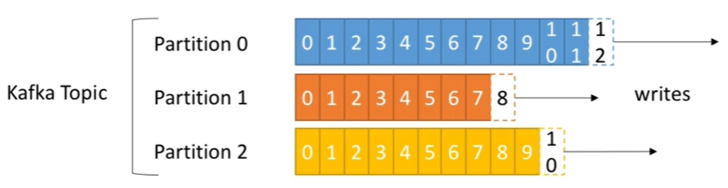

## Kafka Basic Theory

### <ins>Topic</ins>: a particular stream of data

**The Topic in Kafka is going to be the base of everything.**

* Similar to a table in a database (without all the constraints)
* You can have as many topics as you want
* A topic is identified by its <ins>name</ins>

### Topics are split in <ins>Partitions</ins>

Partitions is something concrete.

For example, for this one topic in the bottom, we can have three partitions.
And these three partitions have numbers, and these numbers start at zero and go all the way to whatever.

* Each Partition is ordered
* Each message within a partition gets an incremental id, called <ins>offset</ins>

So as you can see, Partition 0, Partition 1 and Partition 2, in my example, they are not going to have the same number of messages.

It's **independence**.

**You can also see that the Offsets 0, does not mean anything on its own.**

It needs to be Kafka topic, blah blah blah, Partition 0, Offset 0, for it to make sense.
