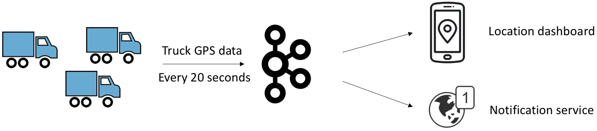

## Kafka Basic Theory

### <ins>Topic</ins>: a particular stream of data

**The Topic in Kafka is going to be the base of everything.**

* Similar to a table in a database (without all the constraints)
* You can have as many topics as you want
* A topic is identified by its <ins>name</ins>

### Topics are split in <ins>Partitions</ins>

Partitions is something concrete.

For example, for this one topic in the bottom, we can have three partitions.
And these three partitions have numbers, and these numbers start at zero and go all the way to whatever.

* Each Partition is ordered
* Each message within a partition gets an incremental id, called <ins>offset</ins>

So as you can see, all the messages going to Partition 0 have an incremental ID
called offsets.
And it's infinite, it's unbounded. And the same way for Partition 1.
You are going to have incremental IDs, or offsets, from 0 all the way to 8.
And from Partition 2, we're going to also have incremental IDs, or offsets,
which is going to be going from 0 to 10.

So as you can see, Partition 0, Partition 1 and Partition 2, in my example,
they're not going to have the same number of messages.

It's **independence**.

**You can also see that the Offsets 0, does not mean anything on its own.**

It needs to be Kafka topic, blah blah blah, Partition 0, Offset 0, for it to make sense.

### Topic example: **trucks_gps**

When we face a new concept, the best way is always to use things in life as examples.
So this is a very concrete example.
We are a trucking company, and we have many, many trucks.
And each truck has a GPS in it.
And basically we want each truck to report the GPS position in some way, to Kafka.

- Say you have a fleet of trucks, each truck reports its GPS position to Kafka.
- You can have a Topic, `truck_gps`, that contains the position of all trucks.
- Each truck will send a message to Kafka every 20 seconds, each message will contain the truck ID and the truck position (latitude and longitude).
- We choose to create that Topic with 10 partitions (arbitrary number).

And so, basically, in Kafka -- so Kafka is in the middle --
we're going to have a Topic.

And the Topic, for the name, I'm going to name it `trucks_gps`.

So you can name it whatever you want. I name it `trucks_gps`.
Because it indicates, what the stream, the Topic, will have.

So this Topic, `trucks_gps`, contains the position of all the trucks.
And so each truck, basically, through some mechanism, will send the data to
Kafka every 20 seconds, for example, it's arbitrary.

And each message...

So this is what goes into a Partition, what is a message.
Each message will contain the truck ID, and also the truck position, latitude
and longitude.

So the information here we have is that, we have each truck reporting, sending
message of their own to Kafka through the same `truck_gps` topic.

So as you can see, all my trucks, **my 10 thousand trucks, they are going to send
the data out to the same topic.**

***You don't have one Topic per truck.***
And that's a very common pattern in Kafka.

Now, we choose to create the Topic with 10 partitions, and again, that's
arbitraty.
But you have to choose a number of partitions at creation time of the topic.

**Now, why do I want to have this stream in Kafka?**

Well, maybe because, as we've seen before, you want to have consumers of your
data. So maybe you want to have a location dashboard for your employees so they
can look at the trucking data.

Or maybe you want to have a notification service.
For example, when a truck is running out of fuel, or a truck has been driving
for too long and it seems like the operator should take a break.

Or whatever you want.

And you can have as many consumers as you want.
We have a big description of producers and consumers later on.
So, right now, just a high level of review to describe what a topic is.

### Topics, partitions and offsets

Now, a few gotchas.

This is again my topic, and so what can we learn from it?

- Offset only have a meaning for a specific partition.

    - E.g. offset 3 in partition 0 doesn't represent the same data as offset 3 in partition 1

- Order is guaranteed only within a partition (not across partitions).
- Once the data is written to a partition, <ins>it can't be changed</ins> (immutability).
- Data is assigned randomly to a partition unless a key is provided (more on this later).

The offset, as I've said, they have a meaning only for a specific partition.
So partition 1, offset 2, is going to be a completely different message and a
different meaning than partition 2, offset 2.

So offsets, they only have meaning for a partition.
And order is going to be guaranteed only within a partition.

So, for example, you can guarantee that offset 8 in my partition 0, we're at
here, has been written after offset 7.

Which has been written after offset 6.

But across partitions - you can see the 6 at partition 0 and the 6 at partition
1, I cannot tell, and it's impossible in Kafka, to tell which message has been
written first unless you read them both.

But per partition, there's only an order per partition, not across partitions.
The data in Kafka, it is kept only for a limited amount of time.
So this data, these offsets right here, they're going to be deleted at some
point.
And by default, it's one week.
So after one week, the data is gone.
But the offsets, they keep on incrementing.
They never go back to zero.

Once the data is written to a partition as well, it can't be changed.
It's called immutability.
So once I write Offset 6 in Partition 1, I can never update it, or just swap it,
or whatever. It can't be changed.
It's six forever, and this is the data I will hold.
If you want to write a new message, you write it at the end of the partition.
And we'll see this when we go to producers, but right now, just know the rule,
which is data will be sent randomly through partition 0, 1 or 2 if you don't
provide a key.
And we'll see this later on, okay?

So this is it for a very high level of review of Topics, Partitions, and
Offsets.
Get familiar with the semantics because we will be using these words all the time.
And it will all make sense in the practice after the theory section, so hold on
with your questions, and get to the practice before asking so many questions.
Okay? See you in the next lecture.
