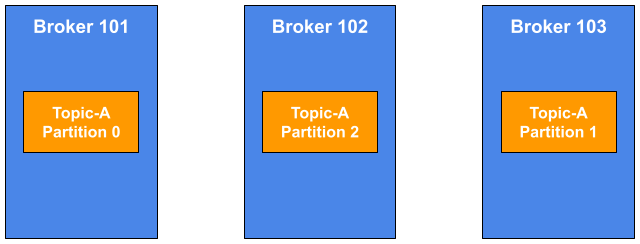
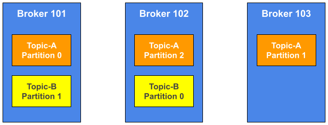

## Brokers

* A Kafka cluster is composed of multiple brokers(servers)
* Each Broker is identified with its ID(integer)
* Each Broker contains certain topic partitions
* After connecting to any Broker (called a bootstrap broker), you will be connected to the entire cluster
* A good number to get started is 3 Brokers, but some big clusters have over 100 Brokers
* In these examples we choose to number Brokers starting at 100 (arbitrary)

OK, so we've talked about Topics, but what holds the Topics? What holds the Partitions?

And the answer is a Broker.

So, we may have heard the term before, it's called a Kafka cluster.
And cluster means that it's comprised, composed of multiple Brokers and each Broker is basically a server, okay?

So, when a cluster use multiple machine, broker means server.

So in the bottom I have three brokers;

I have Broker 101, Broker 102 and Broker 103. But the number is arbitrary. You could be 123, you could be whatever you want.

So, the ID is going to be a number. You cannot have a Broker - "My Broker". It has to be a number.

Now, each Broker will contain only certain topic partitions.

So, we'll see how they get this onto the next slide. But basically, each Broker has some kind of data, but not all the data, okay?

Because Kafka is distributed.

Something there's a whole lecture dedicated on it, but just know about it.

When you connect to one Broker or any Broker that called bootstrap broker, you're connected to the entire cluster.

So in Kafka, when you connected to one Kafka Broker, you're connected to a cluster. Even if you have one hundred Brokers in it.

We'll see how that works later on.

When you get started to Kafka and create a cluster, a good number is three regarding the number of brokers.

But some big clusters of some huge companies do have up to 100 Brokers and that's expected, okay?

## Brokers and Topics

* Example of 🗨Topic-A with🗨 **3 partitions**
* Example of 🗨Topic-B with🗨 **2 partitions**

So intuitively, the first partition of Topic-A is going to be on Broker 101 and for now just read the partition as like the file, okay?
So, Broker 101 will have Partition 0; Broker 102 will have Partition 2; and Broker 103 will have Partition 1.
So as you can see the partition number and the broker number is no relationship.

**It could be in whatever order.**

But as you can see, the Topic is spread. So, Kafka is really good.
When you create a Topic, Kafka will automatically assign the Topic and distribute it accross all your Brokers, okay?
If I am to create Topic-A with three Partitions, the three Partitions will not end on Broker 101.
So it's already done for you.

- - -

Now, if you have a Topic-B with two Partitions, with the Topic-B with Partition 1 and Topic-B with Partition 0 on Broker 101 and 102?

- **Note: Data is distributed and Broker 103 doesn't have any 🗨Topic-B🗨 data.**

So this one, they're less Partitions and number of Brokers. So Broker 103 does not hold any data from Topic-B, okay?

And that's expected.

So it's very very more to understand that. And if you were to create a Topic with four Partitions, then one of the Brokers will have two partitions of the thread Topic, okay?

So you can play around but this is basically it.

So remember this diagram.

In the next lecture we're going to go once level up and talk about replication factor.