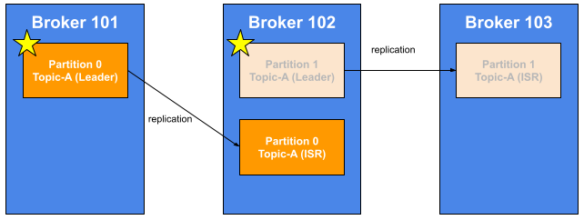

## Topic Replication Factor

As you've seen, Kafka is a distributed system.

We may have three Brokers or one hundred Brokers, so this is distributed.

So, when there's a distributed system in the big data world, we need to have replication, such as,

if a machine goes down, then the things still work, and replication does that for us.

- - -

* Topics should have a replication factor > than 1 (usually between 2 and 3)
* This way if a Broker is down, another Broker can serve the data
* Example: Topic-A with 2 partitions and replication factor of 2

Here is an example, hands-on.

We are going to have Topic-A with 2 partitions. Partition 0 got assigned to Broker 101 and Partition 1 got assigned to Broker 102.

Because there's a replication factor of two, we need to see two replicas of these partitions somewhere.

Partition 0 of Topic-A is also going to be replicated on Broker 102, and Partition 1 of Topic-A is also going to be replicated on Broker 103.
As you can see, I drew an arrow between the partitions.

It's because they're linked. There is some replication happening.
Replication factor of two means that you have two copies of each data.
One orange box and two orange boxes, so that's replication factor of two, okay?

And same for the light orange.
One and one so that's a replication factor of two.

When we create a Topic in the previous lesson, that was replication factor of one.
Now that we have some replication factor, let's look at what happens if we lose Broker 102.

We lose Broker 102, and as you can see, Broker 101 and Broker 103 can still serve the data, even though we lost the middle Broker.

The Broker 101 and 103 still have a copy of the data and that's the trick with replication factor.

It's this cool thing.

To run the example, if you take down Broker 101, and 102 and 103 are still up, than you can still serve the data, as well.

The replication basically allowed us to ensure that data won't be lost, or then would still be able to be served.

## Concept of Leader for a Partition

* <ins>**At any time only ONE Broker can be a leader for a given Partition**</ins>
* <ins>**Only that leader can receive and serve data for a Partition**</ins>
* The other Brokers will synchronize the data
* Therefore each Partition has one leader and multiple ISR (in-sync-replica)

Now that we have replicas, in Kafka there is a concept of a leader for a Partition.

So, golden rule:
At any one time, only one Broker can be a leader for a given Partition.

Only one!

And only that leader can receive and serve data for a Partition.
The other Brokers will just be passive replicas and they will just synchronize the data.
For each Partition is going to have one leader and multiple ISR.

**ISR** in Kafka world means *in-sync replica*.

Let's have a look at the previous example.

This time, for Partition 0, Broker 101 is going to be the leader, while Broker 102 is going to be a replica, or ISR.

As you can see, the replication goes from Partition 0 on Broker 101 to Partition 0 on Broker 102.

Similarly, for Partition 1, there's going to be Broker 102 that will be the leader for Partition 1, and then the replication will happen all the way to Partition 1 on Broker 103.

So that's the important thing.
As you can see, there's a leader and there's a bunch of ISR, or in-sync replica.

So, what decides leaders and ISRs?

We'll see it's called Zookeeper, okay?
It's not something you have to worry about, there are also questions.

What if Broker 101 goes down?
Is there election that happens?

Yes, if Broker 101 on the left-hand side is lost, then the Partition 0 on <ins>**Broker 102 will become the leader because it was an in-sync replica before, and then wehen Broker 101 comes back, it will try to become the leader again**</ins>.