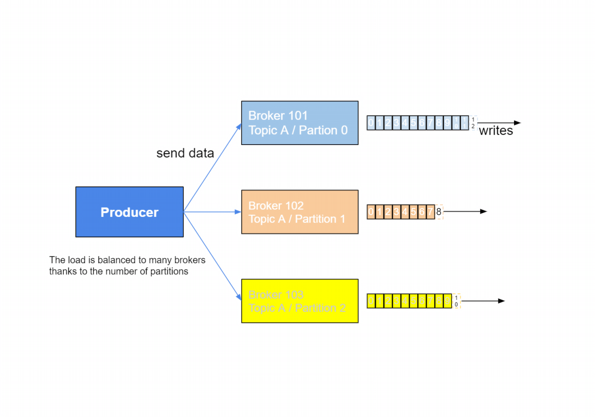
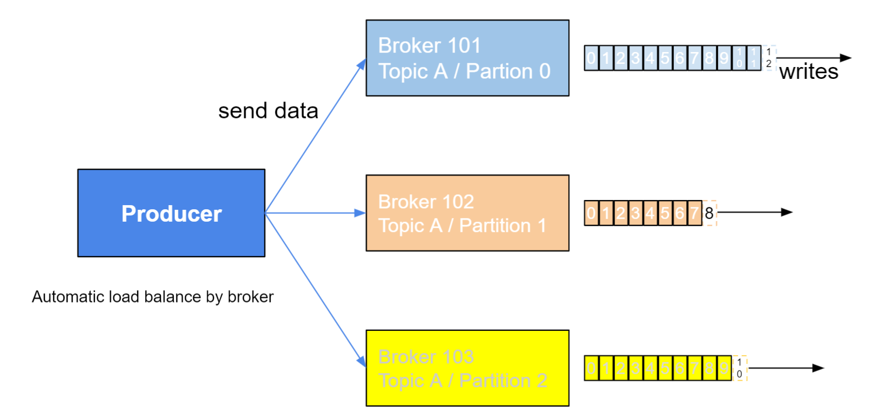
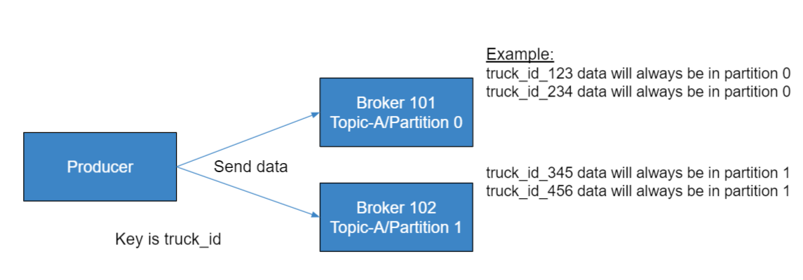

Okay, so we know all about topics, we know all about brokers, we know about replication, but now how do we get data into Kafka?

Well, that's the role of a Producer.

## Producers

* Producers write data to topics (which is made of partitions)
* Producers automatically know to which broker and partition to write to
* In case of Broker failures, Producers will automatically recover

And producers, they will write data to topics and the topics again are made of partitions, so producers are kind of migical, but people who write producers to clients will use is that producers automatically know which broker and partition to write to, we don't have to specify that.

And so for you, that removes a lot of the burden, you just connect to Kafka and then the producers automatically know to which broker and partition to write to.

When there's a broker failure, for example, and the broker goes down as we see in the previous example, the producers, they will automatically recover.

They're good, they're just well-programmed.

You don't have to implement that feature, it's done for you.

So here's what it looks like in real life.

So we have a producer, and it's sending data to partition zero, one and two of topic A. And now we have the source of these writes that we had before.

And so basically the producer, we'll see how it understands to which broker you send data to, but basically, if you send the without a key then data will be sent round robin to broker 101, 102 and 103.

So basically, be sending data to Kafka, to the topic, the producer will load balance.

Automatically send a little bit to broker one, a little bit to broker two, a little bit to broker three, and then switch on again. So this is how load balancing is done in Kafka.

* Producers can choose to receive acknowledgement of data writes:

  * <ins>**acks=0**</ins>: Producer won't wait for acknowledgement (possible data loss)
  * <ins>**acks=1**</ins>: Producer will wait for leader acknoledgement (limited data loss)
  * <ins>**acks=all**</ins>: Leader + Replicas acknoledgement (no data loss)

Now, if we take the exact same topic, before we go into load balancing and keys, let's look at how the producer can write.

So the producer can choose to receive acknowledgement of data writes. Acknowledgement is a synonym of confirmation. And there's three confirmation or acknoledgement modes.

Acks equals zero, which is the producer just sends the data  and you will not wait for acknoledgement. In that case there is a possible data loss.

Because if you send the data to your broker and the broker is down, but we don't know about it because we set acks equals zero and we weill not get an acknoledgement and we will lose the data, so this is tricky and we'll see examples in which acks equals zero is used but it's very dangerous.

Acks equals one is the default, which is producer will wait for the leader to acknoledge, so it sends data, for example to partition zero, to broker 101, and it says, hey, here's the data. And when the broker has it, and it's written and stuff, the broker will say, alright, I have it, here's the acknoledgements. And so there's limited data loss, we'll see when data loss happens for this case.

And then there's acks equals all. And acks equals all is the leader, so broker 101 for example, and all the replicas, so the replicas are not show in this diagram but you can remember the replica diagram, so the leader and the replicas have to say, yep, I got the data and then you have no data loss because you know that the replicas also have the data so even if you lose broker 101, you're good.

Anyway, this is a bit advanced right now, but just remember, we have three send modes, zero one and all for acks. And the more you go towards all, the less data loss you'll get.

## Producers: Message Keys

* Producers can choose to sent a **key** with the message (string, number, etc.)
* If key=null, data is sent round robin (broker 101 then 102 then 103...) 
* If a key is sent, then all messages for that key will always go to the same partition
* A key is basically sent if you need message ordering for a specific field (ex: truck_id)

Now let's talk about message keys for producers.
Producers can choose to send a key with the message and the key can be anything you want.
It can be a string, it can be a number, it can be whatever you want and if the key is not sent so key equals null then the data will be sent round robin, so this is what we saw before.

So that means the first data, the first message will be sent to broker 101, then the second message will be sent to broker 102, et cetera, et cetera, et cetera.

So it round robins across the partitions and therefore across the brokers.

And if a key is sent, then all the messages for that key will always go to the same partition, that's a Kafka guarantee.

So what is a key?

A key is, as I said, anything that you want. String and number et cetera, et cetera. So a key is something you would specify when you need message ordering for a specific field of your data.

So if we go back to my trucking example, a thousand trucks, right, and we want each data for each truck to be in order, okay. Not across the trucks but just for my one truck, I want to get the data in order. And so I will choose my key to be truck_id, and maybe even truck_id as a number, maybe as a string, okay, but I will choose truck_id as my key.

So now we have our producer and we'll send data and using the key equals truck_id, what happens is that, as an example, truck_id_123, so that's my 123rd truck, the data for truck_id_123 will always go to partition zero. And truck_id_234 also will always go to partition zero. But that's arbitrary, okay, and truck_id_345 could be going to partition one, and 456 will always go to partition one as well.

And so basically, the mechanism of key to partition is called hashing, and it's a bit advanced, but it's called key hashing and it depends on the number of partition and what ever you choose but the bottom line is you don't say this key goes to this partition, but you know this key will always go to the same partition.

So for example, we always know that truck_id_123 will go to partition zero. If it goes once there, it will go all the time there. We'll see this again in hands-on, it will probably make more sense.

---

So that's about it for Producers, at a high level, again, just remember there is keys, the concept of keys, the concept of acknowledgements, the concept of round robin, but you get the idea.

And in the next lecture, we'll see the other side of the picture which is consumers.