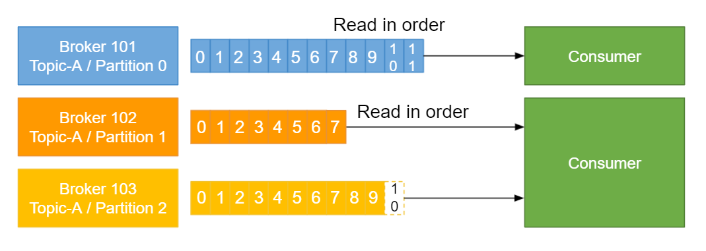
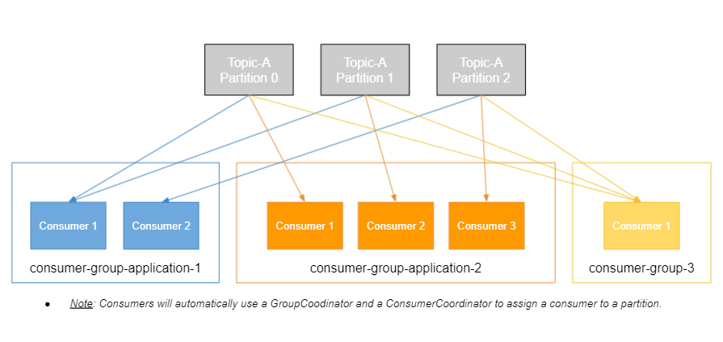

## Consumers

Now, we're getting into the very important concept of consumers.

We know about producers, but now things need to read data, so here is consumers.

* Consumers read data from a topic (identified by name)
* Consumers know which broker to read from
* In case of broker failures, consumers know how to recover
* Data is read in order <ins>**within each partitions**</ins>

As we said, consumers will read data from a topic, and the topic is going to be identified by its name. The consumers, they know which broker to read from automatically, it's already programmed for you, and, in case of broker failures, just like producers, the consumers will know how to recover. This is already done for you. You don't have to think about this. Data, overall, will be read in order within each partition.
So we'll see what that means right now.

We have Broker 101 and Topic-A Partition Zero, and we have a consumer reading from it.
It's going to read data. So as I said, it's going to read data in order.
I will read message zero, or Offset Zero, then Offset One, Offset two, et cetera, et cetera, up to Offset 11.

So as you can see here, the data is read in order.
The consumer will not see Offset Three before seeing Offset Two.
It's really important to understand that. Now, consumers can also read from multiple partitions.
In this example, we have another consumer, and it's reading the data in order for Partition One, but it's also reading the data in order for Partition Two.
But, as you can see, there is no guarantee across the order between Partition One and Partition Two.
It reads them in parallel.
So the actual mechanism, some students ask me this, is that it will read a little bit from Partition One, then it will read a little bit from Partition Two, and then a little bit from Partition One, et cetera, et cetera.
There is no specific order, and you can see Offset Five appear on Partition Two before Partition One or the opposite.
There is no guarantee.
But the bottom line is the data for each partition, within each partition, is read in order.

## Consumer Groups

Now, how do these consumers read data from all the partitions, et cetera, et cetera?

* Consumers read data in consumer groups
* Each consumer within a group reads from exclusive partitions
* If you have more consumers than partitions, some consumers will be inactive

There is a concept of consumer groups. Basically, you're gonna have a lot of consumers, and a consumer is basically like a Java application or whatever language you're using, and they will read data in groups.
Each consumer within a group will read directly from exclusive partitions.

And if you have more consumers than partitions, some will be inactive.
We'll see this in the very next slide.

Here's an example.
We have our Topic-A and it has three partitions. Now, we have our first consumer group, and, basically, a consumer group represents an application.
For example, this is my dashboard application, and I have two consumers.
Well, the Consumer One is going to read from two partitions, and the Consumer Two is going to read from the third partition.
As you can see, this was the example just like before, Consumer One reads from two partitions at a time, while Consumer Two just one at a time.
Now, we've an other application, maybe it's an analytics application, and this one has three consumers.
The name of the consumer group is whatever you wanna name it, but we'll name it consumer-group-application-2.
In this case, each consumer will read from one partition only.
And, finally, say we've a third application, that's maybe out notification service, and we have one consumer only.
Well, that one consumer is going to be reading from the three partitions at the same time.
As you can see, the work is divided.
But what happens when you have more consumers and stuff?
Just before we drew up this, just know that the consumers, they will know exactly how to coordinate, and how to go to which partition automatically, using the group coordinator and consumer coordinator.
It's not something you have to program. It's a mechanizm already implemented in Kafka, and we'll see a demo of it.

### Consumer Groups - What if too many consumers?

What if you have too many consumers?

* If you have more consumers than partitions, some consumers will be inactive

Well, if you have more consumers than partitions, as I said, some consumers will be inactive.

Here's an example.
We have four consumers in our application, and only three can read from partitions, because we only have three partitions to read from.
The fourth consumer is here to be inactive.
Sometimes you may want that, because say you're gonna lose Consumer 3, like the application just stops or the machine shuts down, then Consumer 4 can take over right away.

This is the only case where you would want this.
But, usually, you don't have inactive consumers. You just have as many consumers as partitions at most.
That's why it's so important when you choose a number of partitions for your topic.
If you want to have a high number of consumers, you need to have a high number of partitions. This is a decision that you have to make.

In this example, we have three partitions, so we can only have three consumers, max, at the same time in a consuer group, otherwise others will be inactive.

I hope that helps. We'll see again all these concepts in the hands-on when we start getting our hands dirty, but, at a high level, they should make sense.

If you have any questions, wait until the hands-on.
I will see you in the next lecture.