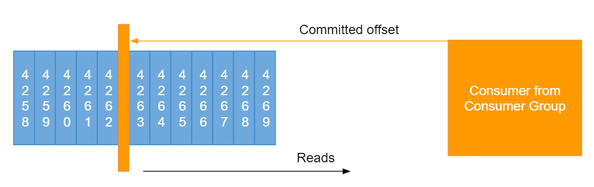

Okay, so now we're getting into the really important concept of consumer offsets.

## Consumer Offsets

* Kafka stores the offsets at which a consumer group has been reading
* The offsets committed live in a Kafka topic named __consumer_offsets
* When a consumer in a group has processed data received from Kafka, it should be committing the offsets
* If a consumer dies, it will be able to read back from where it left off thanks to the committed consumer offsets!

So, we know about consumer. We know about offsets, but we don't know, yet, about consumer offsets.
So, Kafka basically has a capability that is able to restore the offsets at which a consumer group has been reading.
And this is very convenient. Think of it as, like, checkpointing, or bookmarking, okay?
And these offsets, they're committed as your consumer groups reads data, so they commit it live.
And they will be stored in a Kafka topic, and that Kafka topic is named underscore underscore consumer underscore offsets.
And, so, it's good for you to know.

Now, when a consumer basically in a group, we've seen the group before. When this has processed data and done what it's need to do, then it will be committing the offsets into Kafka, and committing the offsets is the action of writing through the topic named consumer offsets.
This is done, again, automatically for you, or you can program it.

You don't have to implement it yourself. Now, why would we do this? Well, we do this because if a consumer dies, okay, if your mission goes down, and then your consumer goes back up, it will be able to read back exactly from where it left off, okay?
Because it says, hey, by the way, I have done everything up to this offsets, and I was dead, now I'm back alive, so now I know I can start at this offset and continue to read from there.
And, so, here's an example, okay?
So, this is our topic, and as you can see, has many offsets, like 4,269, all the way there.
And we have our consumer from a consumer group, so it's been consuming for a while now.
And, so, after processing a bit, it's going to say, "I'm going to commit my offsets at 4262, right after 4262."
And then it says, "Cool, I got it."
And then it's going to read from this offsets, from 4262.
And, so, that's the action, so even if it went down, Kafka will say, "Hey, by the way, 4262 is your committed offsets."
"This is where you should start to read from."
And the consumer says, "Okay, I'm going to choose", "to ask for 4263, 4264, et cetera, et cetera."
And so, that's the concept of committing offsets.

## Delivery semantics for consumers

Now, committing offsets implies something called delivery semantics, and I'm going to give you an intro to this. We're going to see this in much greater detail in the next lessons, in the advanced section.
But right now, at a high level, you need to understand that the consumers, they choose when they commit their offsets.

- Consumers choose when to commit offsets.
- There are 3 delivery semantics:

- At most once:

  - offsets are committed as soon as the message is received.
  - If the processing goes wrong, the message will be lost (it won't be read again).

- At least once (usually preferred):

  - offsets are committed after the message is processed.

Okay, you have the possibility to choose this, and, so, that gives you three delivery semantics.

At most once, at least once, and exactly onece.

So, first, at most once, it's when offsets are committed as soon as the message is received, okay?
And if the processing goes wrong, the message will be lost. It won't be read again.
I'll have a slide on this, in the advanced section, explaining exactly what happens.
So, at most once is usually not preferred.

At least once is usually the preferred way of consuming, so you commit 