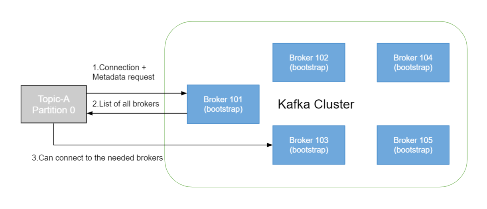

So now let's talk about Kafka broker discovery.

## Kafka Broker Discovery

* Every Kafka broker is also called a "bootstrap server"
* That means that **you only need to connect to one broker**, and you will be connected to the entire cluster.
* Each broker knows about all brokers, topics and partitions (metadata)

So I mentioned that your producer or your consumer, they can automatically figure out which broker they can send data to, etc., etc.
And so you may be like, "How does this work?"
Well, every Kafka broker, basically it's called a bootstrap server.
That means that you can connect to one broker only and because it's a bootstrap server, but remember every server is a bootstrap server, then the server will be able to tell you how to connect to all the other servers in the entire cluster.

And so basically this is the beautiful thing about the Kafka, is that each broker knows about all the other brokers, all the topics and all partitions.
It does necessarily hold all that data, but it knows about it.
It's called metadata.
So it knows which broker has which topic and which partition.

And so here's what it looks like.
Say we have a Kafka cluster with five brokers, okay.
And as I said, all of them are bootstrap broker. So your Kafka client, it could be a producer or a consumer, it will connect to say broker 101, but it could connect to any of them. It could be broker 102, it could be broker 103, any one you want.

So you connect to your first broker. And then when the connection is established, your client automatically behind the scenes will do something called a metadata request.
And the broker 101 will come back and say, "Hey, here's your metadata, including the least of all the brokers and their IPs etc., etc., etc."
And so the client will say, "Ah, good, I got it."
And when it starts producing or consuming, it knows to which broker it needs to connect automatically.
And so that's how broker discovery works.

And so this is not something for you to implement, this is already implemented for you.
But this is something to know about, okay.

When you have a Kafka cluster, even if it has 100 brokers, you only need to connect to one broker to get connected to the entire thing.
And your clients are smart enough to figure out afterwards to which broker they should connect to.
So this is something you've heard many about, so hopefully that explains it.
It's happening behind the scene for you.
All of this is auto-magical, I call it auto-magical.
But this is done for you, so you don't have to worry about it.
And so when you do implement your application, remember you don't need to reference all your brokers, just one, two, or three, whatever you want, and you connect it to the entire thing.
So hopefully this removes a bit of the magic of Kafka and explains a few things.
And I will see you in the next lecture.