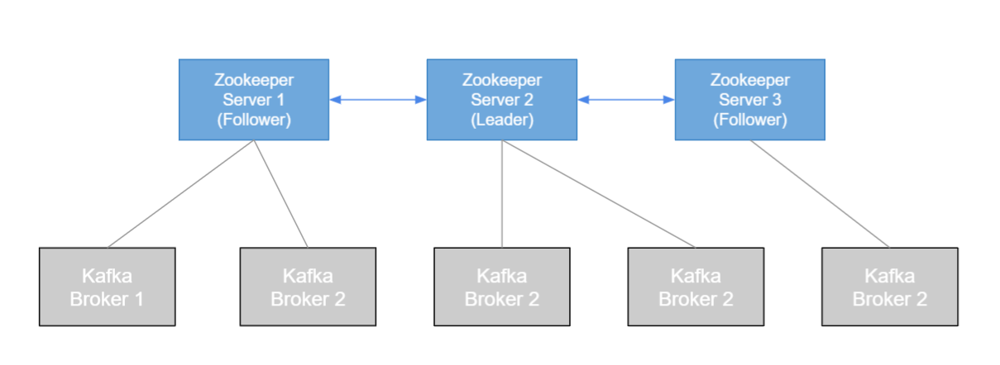

Okay, so now we're getting into Zookeeper, and Zookeeper, it's always there but we haven't really talked about it.
So Zookeeper is what holds the brokers together.

## Zookeeper

* Zookeeper manages brokers (keeps a list of them)
* Zookeeper helps in performing leader election for partitions
* Zookeeper sends notifications to Kafka in case of changes (e.g. new topic, broker dies, broker comes up, delete topics, etc....)
* <ins>**Kafka can't work without Zookeeper**</ins>
* Zookeeper by design operates with an odd number of servers (3, 5, 7)
* Zookeeper has a leader (handle writes) the rest of the servers are followers (handle reads)
* (Zookeeper does NOT store consumer offsets with Kafka > v0.10)

It manages the broker, so it keeps a list of them.
And Zookeeper will also help in performing leader election for partitions.
So remember when a broker goes down, there's a new partition that becomes a leader, Zookeeper helps with that.
Zookeeper also will send notification to Kafka, in case there is any changes, so when a topic is created, when the broker comes up, when you delete a topic, et cetera, et cetera.
Zookeeper sends notifications to Kafka. So Kafka, as you can understand, it cannot work without Zookeeper. And so you'll see in the next lectures, when we start Kafka, we first have to start Zookeeper, okay. So for now, Zookeeper is needed in Kafka.

Now, Zookeeper by design, in production, it operates with an odd number of server, and that's just how Zookeeper works, you can't do anything about it.
So in the hands on, we'll start one Zookeeper but when you set up a real Kafka cluster in production, you'll have three, five or seven Zookeepers, okay.

Overall, Zookeeper has also a concept of leader and followers. So Zookeeper has a leader, and the leader handle the writes from brokers.
And the rest of the servers are followers, and they handle the reads, okay.

So your producers and your consumers, they don't write to Zookeeper, right, they write to Kafka.
Kafka just manages all metadata in Zookeeper.

Overall, there is a very, very important thing, Kafka offers 0.10 version, so pretty much for the last year and a half, two years.
Zookeeper does not store consumer offsets. It used to be the case before, but not anymore.
Zookeeper is completely isolated from your consumers and your producers.
And as we've seen in the lecture before, consumer offsets are stored in a Kafka topic, okay.

So here's what it looks like realistically.

So we have a three server Zookeeper cluster.
And one of them is the leader, that's number two and the rest are followers.
And we have five brokers and so the brokers are connected to different Zookeeper servers, it doesn't really matter.
All we have to understand is that the writes go to the leader and their followers and the leader can give reads.
And so basically your Kafka cluster is going to be connected to a Zookeeper cluster.
And automatically, it will understand when brokers are down, when topics are created, et cetera, et cetera.

So Zookeeper is very, very important to have in Kafka correctly and well set up.
But we will no be dealing with Zookeeper directly.
We'll just be dealing with Kafka brokers most of the time, okay.

So that's it for Zookeeper.
That's all you need to know as a beginner level.
And I will see you in the next lecture.