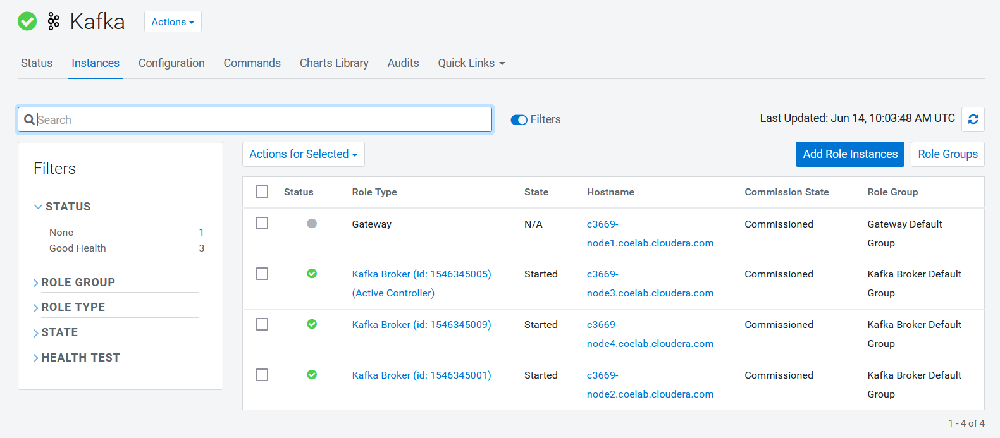

<!-- MarkdownTOC -->

* Environment
* Steps of Broker Migration

  * Step-1: Start up the new broker as a member of the old cluster.
  * Step-2: Stop both the new broker and the old broker that it is replacing.
  * Step-3: Change `broker.id` of the new broker to the broker.id of the old one both in Cloudera Manager and in data directory/meta.properties.
  * Step-4: Start up the new broker.

<!-- /MarkdownTOC -->

Purpose of this artical:

Our purpose is to replace the nodes of Kafka Broker.
We have 2 nodes newly added to the CDP PvC Base cluster.
We will migrate two Kafka Brokers that were originally in use to these two new nodes.
This article uses Cloudera [CDP official documentation](https://docs.cloudera.com/cdp-private-cloud-base/7.1.6/kafka-managing/topics/kafka-manage-migration-idmod.html) as a guide.

## Environment

Here are the currently in use Kafka Brokers:

| Broker     | Host                            | IP            |
| ---------- | ------------------------------- | ------------- |
| 1546345005 | c3669-node3.coelab.cloudera.com | 172.25.36.133 |
| 1546345009 | c3669-node4.coelab.cloudera.com | 172.25.36.207 |
| 1546345001 | c3669-node2.coelab.cloudera.com | 172.25.36.206 |

## Steps of Broker Migration

### Step-1: Start up the new broker as a member of the old cluster.

CM UI -> Kafka -> Instances -> Add Role Instances

We are only adding one Broker at a time, we need to replace the Brokers one by one.

After adding host - <ins>**host-10-17-102-138.coe.cloudera.com**</ins> as Kafka Broker, it should be not starting yet.
Now we'll see <ins>there's stale status in Kafka Broker cluster</ins>, so **deploy the client configurations** by clicking the stale status icon on CM UI.

Now, start the newly added Broker on <ins>**host-10-17-102-138.coe.cloudera.com**</ins>.

### Step-2: Stop both the new broker and the old broker that it is replacing.

In this example, I'm replacing the old Broker - 1546345005 on <ins>**c3669-node3.coelab.cloudera.com**</ins> with the new Broker - 1546351866 on <ins>**host-10-17-102-138.coe.cloudera.com**</ins>.

### Step-3: Change `broker.id` of the new broker to the broker.id of the old one both in Cloudera Manager and in data directory/meta.properties.

We need to change the `broker.id` to the old one on the new Broker host.

We also need to change the `broker.id` to the old one on CM UI.
This will trigger a staleness computaion, so deploy the client configuration as indicated by CM UI.

### Step-4: Start up the new broker.

We now can start the new Broker on host - <ins>**host-10-17-102-138.coe.cloudera.com**</ins>. Before starting, we would see WARNING message about: "<ins>lagging replicas</ins>" as of health check.

After starting the new Broker, after a while (depends on the data volume on your cluster), the Kafka Broker cluster will become healthy again.

---

That's all for Broker replacement/migration.
Thanks for reading.
